# COORD-Harness

<p align="center">
  <strong>One authority. Many workers. Inspectable proof.</strong><br>
  A local-first control plane for Claude, Codex, MCP clients, shell agents, and local model jobs:
  claim without colliding, hand off bounded context, supervise long processes, and finish only when the declared proof exists.
</p>

<p align="center">
  <a href="LICENSE"></a>
  <a href="pyproject.toml"></a>
  <a href="docs/mcp-integration.md"></a>
  <a href="docs/security-and-privacy.md"></a>
</p>

<!-- S1 -->
<p align="center">
  <a href="docs/getting-started.md">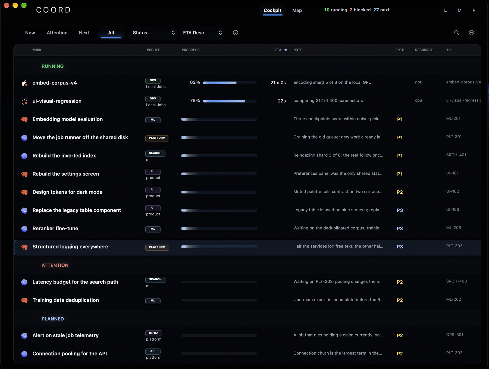</a>
</p>

<p align="center"><sub><b>This is the surface an operator lives in.</b> Grouped, dense, and capped: each group renders a bounded number of rows and then states exactly how many it is withholding. The title is the only element at full contrast, so the list can be scanned by title alone.</sub></p>

<p align="center">
  <a href="#two-agents-one-file">How two agents share work</a> ·
  <a href="#five-minute-start">Five-minute start</a> ·
  <a href="#what-an-operator-actually-sees">The product</a> ·
  <a href="#how-work-moves">Mechanism</a> ·
  <a href="#what-the-harness-remembers">Context and memory</a>
</p>

A single agent in a chat window needs none of this. A **fleet** does — several
agents, of different kinds, working the same large repository across days, where
no one process lives long enough to remember what happened and no human is
watching every minute.

`coordharness` is the local-first machinery that makes that fleet durable. Claude
Code, Codex, generic MCP clients, shell automation, and local CPU/GPU jobs share
one typed operating vocabulary without making any individual client the
authority.

**Nothing here is a hosted service.** It is one database, one machine, one trusted
user account, and a handful of processes that agree to write through the same
door.

> **Distribution:** this repository is the public source for COORD-Harness. It does not claim a hosted service, package-index publication, App Store availability, or signed binary distribution.

<!-- S2 -->
<p align="center">
  <a href="docs/swarm-mesh.md">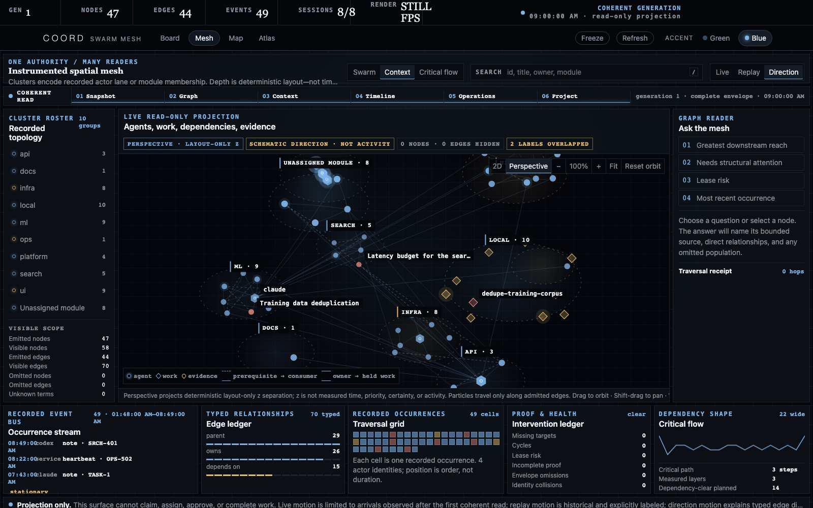</a>
</p>

<p align="center"><sub><b>The fleet as one coherent read.</b> The Cockpit above remains the primary operating surface; Mesh adds the spatial view of the same bounded authority, with typed relationships, traversal, and explicit receipts for what the read omitted.</sub></p>

<!-- D1 -->
<p align="center">
  
</p>

<p align="center"><sub>One database owns lifecycle truth. CLI, MCP, and Python are clients of its fenced operation contract, never parallel authorities. Claims prevent collisions, heartbeats renew ownership, completion is proof-gated, and every viewer is a read-only projection.</sub></p>

---

## Two agents, one file

This is the part that is easy to overcomplicate, so here it is plainly.

**Claude and Codex never talk to each other directly.** There is no chat channel
between them, no shared queue, no sync protocol. Both read and write **one SQLite
file**, and everything either one knows about the other, it learned by reading it.

That sounds austere, and it is the entire trick. A message can be missed,
contradicted, or quietly ignored. A row in a database cannot: it is either claimed
or it is not, and the claim names who holds it and when the lease expires.

<!-- D2 -->
<p align="center">
  
</p>

<p align="center"><sub>Three ways in, one way through. A claim made by <code>coord claim</code>, by <code>claim_work(...)</code> over MCP, and by the Python API are the same row written by the same code. <b>No client-to-client sync. No mirrored status store.</b></sub></p>

### How each agent knows what the other is doing

An agent starts by asking the board, not its colleague. One call returns what is
running, what is blocked, who holds which claim, and what recently changed.
**Awareness is a read, not a broadcast** — which is why it survives an agent
crashing, restarting, or being a different agent than it was last time.

Status is never stored. It is *derived* at read time from the claim lease and
whether the process holding it is still alive. Nothing can be marked "running" by
a process that has died, because nothing marks it running at all.

### Handing work over

A handoff is an **ownership transaction, not a request**. When one agent hands a
row to the other, the row's assignee changes in the database, and the previous
owner's next attempt to claim it **fails with an error** rather than succeeding
quietly.

<!-- D3 -->
<p align="center">
  
</p>

<p align="center"><sub>The refusal is the point. Two agents cannot both believe they own the same work, because the second one to try is told <code>cannot claim work assigned to 'codex'</code>. The fence &mdash; the row's version and its event heads &mdash; makes the transfer atomic against a board that is still moving.</sub></p>

The handoff carries what the receiver actually needs: the task, why it matters,
pointers to the evidence, the acceptance criteria, and a concrete artifact path
that must exist before the work can be called done.

### Talking mid-run without taking the work

Sometimes an agent needs to tell the other something *while it is still working* —
a number moved, an assumption broke, a file is being edited. That is a **note**:
an append-only message attached to a row, addressed to the other lane, carrying
**no authority at all**. It cannot change ownership, status, or verdict.

That is exactly why it is safe. One agent can warn another mid-run without
reaching into its work.

```bash
# Claude, mid-run, tells Codex something it needs before it quotes a number
coord note ML-204 \
  --body "The denominator moved from 8,642 to 8,648 while you were running. Re-read before quoting a rate." \
  --ref docs/coordination-model.md

# Codex, on its next check — newest first, and it says what it did not show
coord inbox
{"count": 20, "unread_total": 46, "not_shown": 26, "order": "newest_first", ...}
```

The inbox reads **newest first**, because the question an agent asks mid-run is
"did anything arrive while I was working", not "let me drain the queue in order".
`--backlog` restores queue order for the case that wants it. It also reports
`unread_total` and `not_shown`, so *"nothing new arrived"* is a fact rather than an
artefact of a limit.

### Why a swarm still shows as one row

When an agent fans out to a dozen subagents, the board does not sprout a dozen
rows. The orchestrator holds **one claim**; the subagents roll up beneath it. The
operator sees one piece of work with one owner, which is the only reading that
stays legible once several agents are working at once.

<!-- D4 -->
<p align="center">
  
</p>

<p align="center"><sub>Bounded subagents return refs and conclusions to their owner instead of impersonating peer sessions. Local jobs run as tracked processes in their own lanes &mdash; the GPU lane serialized, because one machine has one GPU.</sub></p>

---

## Five-minute start

For a real project, including client wiring, local data locations, capability
boundaries, uninstall, and a clean-machine checklist, use the
[standalone setup guide](docs/standalone-setup.md). The commands below are a fictional
demo and do not configure provider accounts or background services.

Run it in a disposable clone. The board it seeds is fictional, and every file it
writes lands in that clone's own gitignored `.coordharness/` directory:

```bash
git clone https://github.com/0marm0/COORD-Harness.git
cd COORD-Harness
python3 -m venv .venv
. .venv/bin/activate
python -m pip install -e '.[mcp]'

python -m coordharness.demo    # seeds .coordharness/coord.db with 37 synthetic rows
coord doctor                   # read-only health report; prints PASS and exits 0
coord board --group-by module  # the same board as JSON
coord-board                    # read-only web board on http://127.0.0.1:7870
```

`coord doctor` is the answer to *"did that work?"*. It opens nothing it does not
have to, writes nothing at all, prints one JSON document, and **exits 0 only when
every finding passes** — so it is worth running again after anything surprising.

Then open [`/`](http://127.0.0.1:7870/) for triage,
[`/mesh`](http://127.0.0.1:7870/mesh) for the spatial control room,
[`/map`](http://127.0.0.1:7870/map) for analytical lenses, or
[`/ops`](http://127.0.0.1:7870/ops) for the joined operational document.

Keep the database and the state directory together. `coord` and `coord doctor` both
default to `.coordharness/coord.db` under the project root; pointing `--db` somewhere
outside `.coordharness/` still works for the CLI and the board, but `coord doctor`
will report `database_outside_state_root` rather than silently trusting it.

To throw it away, delete that one clone. Never point a cleanup command at a broad
directory or an unresolved variable.

[Getting started](docs/getting-started.md) continues from here: claim a row, satisfy
its declared proof, and complete it.

---

## What an operator actually sees

Everything in this section reads the deterministic, entirely fictional board
created by `python -m coordharness.demo`.

The **Board** is where an operator lives. A destination rail separates *Attention* —
grouped by the plane that raised each row — from overview, work, jobs, graph and
activity. Selecting a row opens one canonical detail plane beside the list rather
than navigating away from it.

(The work table above is this same Board — the destination rail just adds
*Attention*, jobs, graph and activity around it.)

<table>
<tr>
<td width="50%" valign="top">
<!-- S3 -->
<a href="docs/assets/screens/board-overview.png">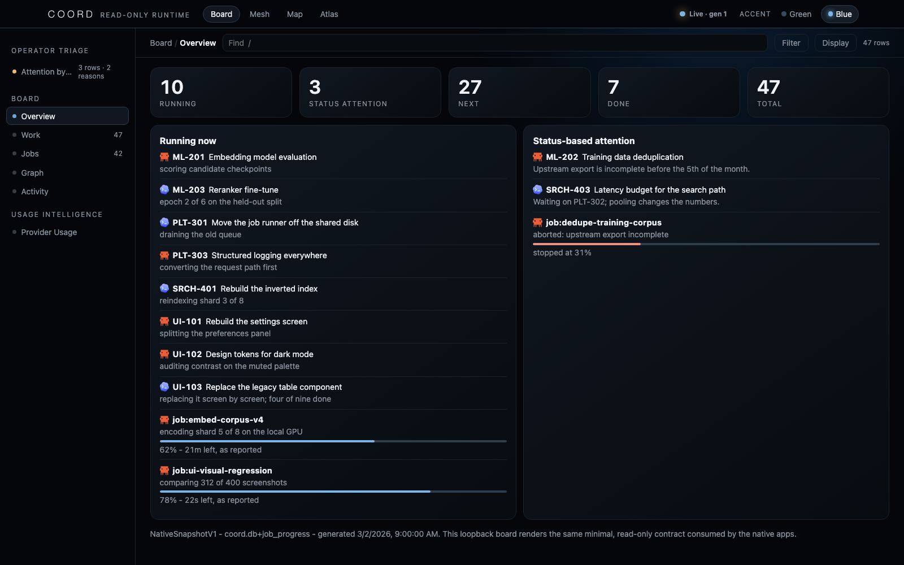</a>
<p><sub><b>Overview &middot; decide what needs attention.</b> Live claims and reported steps sit beside blocked, failed, and flagged rows. Progress and ETA appear only when a tracked job reported them.</sub></p>
</td>
<td width="50%" valign="top">
<!-- S4 -->
<a href="docs/assets/screens/operations-atlas-overview.png">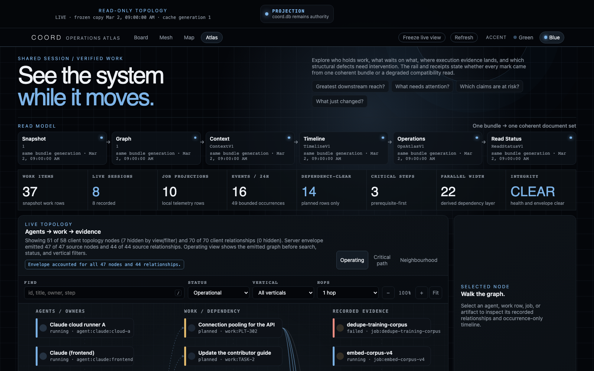</a>
<p><sub><b>Atlas &middot; inspect one coherent generation.</b> Snapshot, graph, context, timeline, operations, and read health meet in one source-accounted document.</sub></p>
</td>
</tr>
</table>

Semantic filters are evaluated by the server and carry a complete matched-ID
receipt; saved views store the query token, never a frozen row list. Display
choices — density, grouping — are personal and stored locally, so a link you send
shows the recipient your *population*, never your row height. The command palette
unifies destinations, rows, and non-mutating actions under one keyboard vocabulary,
and shows refused actions **with the reason they were refused**.

A selected row travels between Board, Mesh, Map, and Atlas in the canonical `#sel=`
URL capsule. Each destination either focuses the admitted node or states that this
bounded projection omitted it; none silently turns "not rendered here" into "does
not exist."

### Choose the surface by question

The four areas share one navigation bar, one palette and one typeface contract. The
macOS Cockpit hosts the same four in the same order, so a Windows or Linux operator
on the web build and a Mac operator in the native window see the same product.

| Question | Area | Why |
|---|---|---|
| What is running or needs attention? | **Board** `/` | compact row state and tracked-job telemetry |
| How is the fleet connected in this coherent read? | **Swarm Mesh** `/mesh` | clustered actor-lane/module/dependency layouts, typed motion, traversal, receipts |
| What does the estate look like through one analytical lens? | **Coordination Map** `/map` | dependencies, shape, subjects, order, crossings, context, recorded parallelism |
| What is structurally actionable in this generation? | **Operations Atlas** `/ops` | joined graph envelope, operational metrics, health, bounded questions |
| What can I glance at away from the browser? | **macOS, menu bar, iOS** | native projections of the same read contract |

Every area is a read-only projection of the same lifecycle authority. Job telemetry
contributes process evidence; graph context and accepted memory improve navigation
and recall; neither can mutate a claim or complete work.

### The analytical lens gallery — six Map views and the exact question each answers

The same rows, asked different questions. Each view states in its own copy what its
geometry does *not* mean: where position or order is arbitrary it says so, and where
a shape would have to imply a measurement the data does not carry, it prints a
sentence instead of drawing the shape.

<table>
<tr>
<td width="50%" valign="top">
<!-- S5 -->
<a href="docs/assets/screens/map-fleet.png">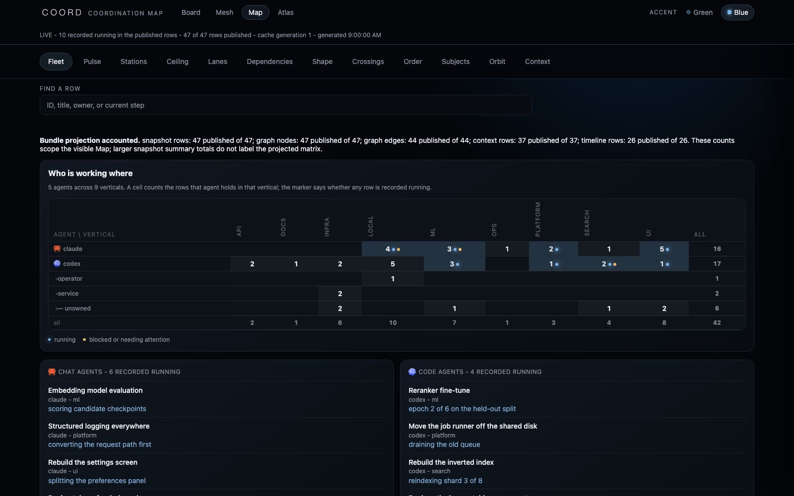</a>
<p><sub><b>Fleet</b> &mdash; who is working where. Recorded lanes against subject areas, with running and attention marked explicitly.</sub></p>
</td>
<td width="50%" valign="top">
<!-- S6 -->
<a href="docs/assets/screens/map-deps.png">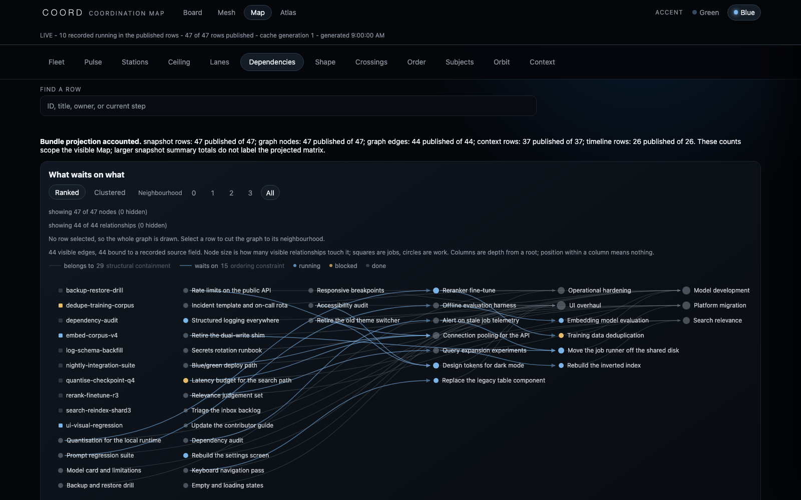</a>
<p><sub><b>Dependencies</b> &mdash; two structural questions a row list cannot answer: recorded downstream reach, and the longest acyclic walk the bounded graph can prove. Neither claims elapsed time or effort.</sub></p>
</td>
</tr>
<tr>
<td width="50%" valign="top">
<!-- S7 -->
<a href="docs/assets/screens/map-chronicle.png">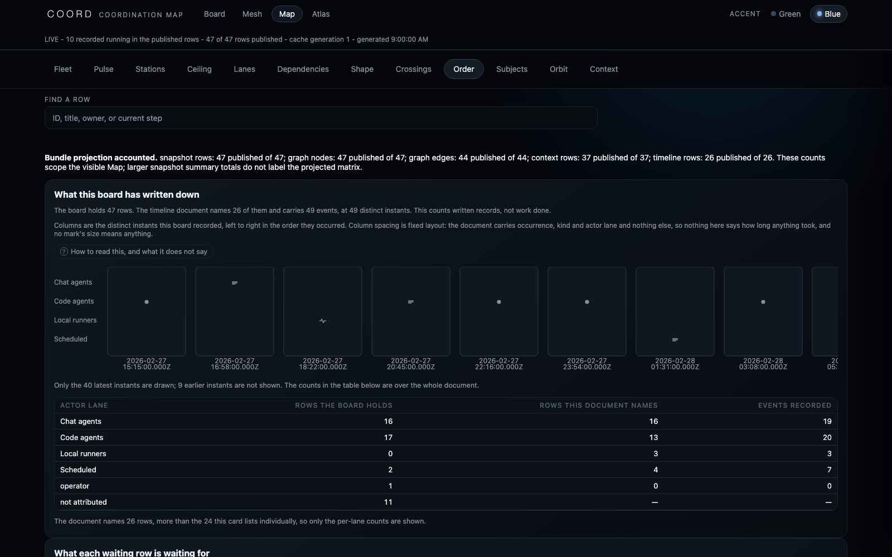</a>
<p><sub><b>Order</b> &mdash; precedence without a clock. Grouped by recorded event order and prerequisite direction; missing events stay missing, and no ordering is presented as elapsed time.</sub></p>
</td>
<td width="50%" valign="top">
<!-- S8 -->
<a href="docs/assets/screens/map-pulse.png">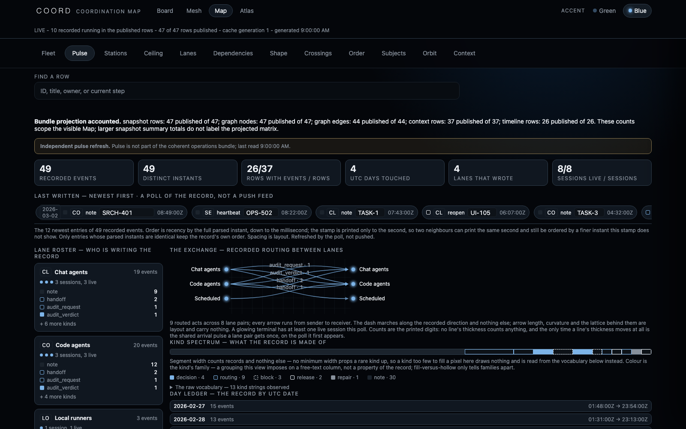</a>
<p><sub><b>Pulse</b> &mdash; the record as a live wire. A poll of the record, not a push feed, and it says so.</sub></p>
</td>
</tr>
<tr>
<td width="50%" valign="top">
<!-- S9 -->
<a href="docs/assets/screens/map-ceiling.png">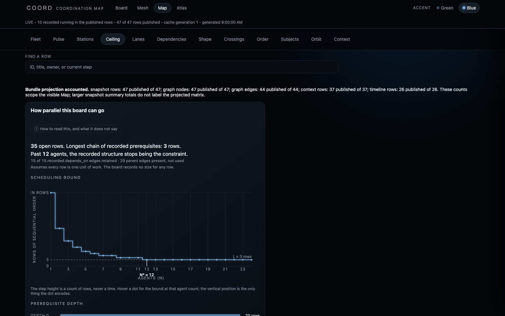</a>
<p><sub><b>Ceiling</b> &mdash; a bounded parallelism thought experiment. Each row gets one equal unit and can start only after its recorded prerequisites. Structural concurrency under that assumption &mdash; not duration, effort, or a staffing forecast.</sub></p>
</td>
<td width="50%" valign="top">
<!-- S10 -->
<a href="docs/assets/screens/map-topology.png">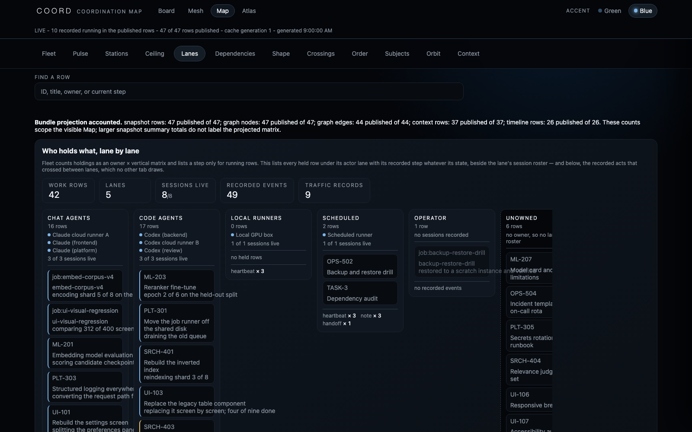</a>
<p><sub><b>Lanes</b> &mdash; the fleet as an org in motion: every held row under its lane, the lane's live sessions, and the recorded acts that crossed between lanes.</sub></p>
</td>
</tr>
</table>

**Motion is evidence, not ambience.** Every moving mark passes through one audited
engine: an arrival pulse fires only for an event genuinely absent from the previous
poll, a marching dash rides only a path drawn in a recorded dependency's direction,
a breathing mark sits only on a row that derives to running. `prefers-reduced-motion`
stills all of it with every fact intact.

The remaining lenses — Shape, Subjects, Orbit, Crossings, Context, Stations — and the
full geometry and motion contract live in the [visual atlas](docs/visual-atlas.md)
and the [Operations Atlas contract](docs/operations-atlas.md).

---

## How work moves

The key separation is between **declared intent** and **observed state**. A work item
may say it is running, but readers only show it as running when a live claim backs
that declaration.

<!-- D5 -->
<p align="center">
  
</p>

<p align="center"><sub>Watch the asymmetry: a bare running claim with no live successor is requeued automatically, but a blocked or paused row keeps its disposition even after its claim releases &mdash; that stop was deliberate, not a dropped lease.</sub></p>

Mechanical work becomes a tracked local process instead of an LLM loop. A wrapper
forks the child into its own process group and writes two channels: a fast local
sidecar and an authoritative `runs` row carrying the real pid and pgid.

<!-- D6 -->
<p align="center">
  
</p>

<p align="center"><sub>The board never trusts a stored status string &mdash; it re-derives liveness by matching the recorded pid against the live process. Two independent paths catch a dead one: an expired lease releases the claim, and a sidecar is marked failed only after every process identity is proven absent, never assumed.</sub></p>

### What it refuses to do

Most of the design is a refusal. Each of these is enforced in code, not by convention:

- **No duplicate ownership.** One held claim per work item, enforced transactionally.
- **No immortal "running" rows.** Status is derived from intent, lease validity, and process evidence at read time — never stored and trusted.
- **No completion by assertion.** A claim completes only when its controller-declared `done_signal` is satisfied.
- **No client lock-in.** The CLI, Python API, and MCP server converge on the same lifecycle functions.
- **No giant cold-start dump.** Preflight, work context, event context, facts, and knowledge queries are bounded.
- **No hidden local work.** Long-running processes report through run records and compact JSON sidecars.
- **No accidental second authority.** Web and native clients consume read-only projections.

### The database

One SQLite database in WAL mode, `.coordharness/coord.db` (WAL keeps `-wal` and
`-shm` working files beside it). WAL is the whole reason a fleet can share it:
readers never block the writer and the writer never blocks readers, so a menu-bar
app polling four times a minute cannot stall an agent mid-claim.

Six lifecycle tables carry the operating core:

| Table | What it is |
|---|---|
| `agent_sessions` | who is present — one row per orchestrator session, with its runner type and identity |
| `work_items` | the work itself — id, title, module, declared intent, priority, and the `done_signal` it must satisfy |
| `claims` | ownership — who holds what, since when, and until when the lease expires |
| `runs` | tracked local processes — the real pid and pgid, so liveness is checked against the OS rather than believed |
| `events` | the append-only history — claims, notes, decisions, handoffs, audit requests and verdicts |
| `artifacts` | the proof — what a completion pointed at, recorded with the transition in one transaction |

The generated schema also contains migration metadata, display titles,
request/inbox cursors, exact-authority and provenance records, and native
projection tables. Those support audit and bounded read models; they do not replace
the six lifecycle tables as the writer authority.

Two properties matter more than the shape. **Nothing is deleted on completion** — a
done row keeps its whole history, which is why "did we already do this?" is a query
rather than a memory. And **status is not a column.** It is computed at read time
from declared intent, lease validity, and process evidence, through views like
`v_work_owner` and `v_runs_read_model`. A row cannot sit at `running` because a
crashed process left it there.

Migrations are ordered SQL under `coord/migrations/`, applied on first use.

Read [architecture](docs/architecture.md), [coordination model](docs/coordination-model.md), [data model](docs/schema.md), and [context architecture](docs/context-architecture.md) for the full treatment.

---

## What the harness remembers

Coordination state and memory are different problems, and this project keeps them
apart on purpose. The section above is the board. This one is everything an agent is
allowed to carry between sessions.

The problem it exists to solve is that a conversation transcript grows without a
ceiling and every call re-reads all of it. A fresh session instead boots from a
bounded capsule, then expands only the source-bound context its work requires.

So memory lives in three stores, and they are not interchangeable:

| Store | Holds | Lifetime |
|---|---|---|
| **Coordination database** | work rows, sessions, claims, runs, events, artifacts | the project's whole history; nothing is deleted on completion |
| **Knowledge store** | the fact ledger, the full-text index, the memory-proposal queue | rebuildable — the index is derived, the facts and proposals are not |
| **Accepted-memory store** | content-addressed accepted notes and a compiled boot kernel | append-only; generations are immutable once built |

Everything else an agent knows is transient. **There is no transcript store, no
conversation archive, no vector database, and no per-agent scratch memory.** A
session that ends leaves rows, events, artifacts and possibly a memory proposal —
nothing else survives it.

<!-- D7 -->
<p align="center">
  
</p>

<p align="center"><sub>Exact board state stays authoritative. Bounded capsules and source-bound graph views help retrieval; accepted memory is a derived recall aid, never a writer and never a lifecycle authority.</sub></p>

The knowledge store is reachable through read-only MCP tools — fact queries, index
status, and the proposal queue — each capped, each carrying provenance, and each
covered by a test that fingerprints the store to prove a read wrote nothing.

The MCP server creates that store on startup, and a fact read **names the store it
read**. If the ledger is missing or has no schema, `facts_lookup` refuses with that
condition and `knowledge_search` records it as an error on the facts provider. It
does not return `count: 0`, because a zero from a store that does not exist is
indistinguishable from a store that genuinely holds no match.

Two things stated plainly rather than implied. **The proposal queue has a narrow,
fenced producer**: a successful session closeout offers only typed decisions
explicitly marked `memory_candidate=true`; ordinary decisions, notes, summaries and
empty sessions emit nothing. And the board's own context endpoint carries
**structure, not prose** — parents, dependencies, dependents and siblings — because
the browser board is read-only and unauthenticated, and decisions and notes are not public.

[Context and memory](docs/context-and-memory.md) is the full chapter — every store,
every module, what each is for, and what is deliberately never written down.

---

## Lifecycle clients: CLI, Python, and MCP

The table names equivalent operations, not separate authorities. They call the same
core against the same file.

| Task | CLI | MCP | Python |
|---|---|---|---|
| Orient | `coord board` | `preflight`, `next_work` | `coord_db.board_rows(...)` |
| Claim | `coord claim WORK --step "…"` | `claim_work(...)` | `coord_db.claim_work(...)` |
| Renew | `coord heartbeat-claim CLAIM --step "…"` | `heartbeat(...)` | `coord_db.heartbeat_claim(...)` |
| Pause/block | `coord release CLAIM --status paused\|blocked ...` | `park(...)`, `block(...)` | typed lifecycle functions |
| Message mid-run | `coord note WORK --body "…"` | `note(...)` | `coord_db.post_note(...)` |
| Reassign work | `coord reassign WORK --owner-lane …` | `handoff_existing(...)` | `coord_db.post_existing_work_handoff(...)` |
| Read messages | `coord inbox` | `inbox`, `inbox_recent` | `coord_db.read_inbox(...)` |
| Complete | `coord done WORK --artifact PATH` | `complete(...)` | `coord_db.complete_claim(...)` |
| Read board | `coord board --group-by module` | `board(...)` | read-only board queries |

### What MCP is doing here

The [Model Context Protocol](https://modelcontextprotocol.io) is how an agent gets
tools it did not ship with: the client launches a server process, they speak
JSON-RPC over stdin and stdout, and the server advertises a catalog the model can
call. No network, no port, no daemon.

`coord-mcp` is that server for this harness. It exposes the same lifecycle functions
the CLI calls — a claim made through `claim_work` and a claim made through
`coord claim` are the same row, written by the same code, because the MCP layer is a
transport rather than a second implementation.

It declares 34 tools and exposes 33 by default; `handoff_existing` is withheld from
the default profile and promoted deliberately, because handing a row to another
agent is the one operation that moves ownership out from under a live holder.

> **Current boundary:** the default generic profile is the one to use. All 33 default tools
> register against a fresh local database, and the ones a first session needs answer there:
> `preflight`, `board`, `next_work`, `work_context`, `event_context`, `inbox`, `inbox_recent`,
> `runs`, `knowledge_search`, `facts_query`, `knowledge_index_status`, the memory-proposal reads,
> and the `claim_work`/`heartbeat`/`note`/`audit`/`decision`/`park`/`release` writers. Two of the
> 33 fail closed on a fresh checkout rather than answering: `facts_lookup` raises
> `FactStoreUnavailable` until a knowledge store exists — no MCP read creates one — and `orient`
> requires an enforced exact-authority policy that a fresh checkout does not activate. The
> remaining lifecycle writers refuse by contract until their preconditions hold: `complete`
> demands the declared artifact in Git's index, `verdict` refuses a same-lane pass, and
> `request_audit` refuses T2/T1 rows that self-verify. The strict deployment profile adds
> repository-custody and exact-authority gates that a public checkout cannot satisfy — it is for
> a deployment that has done its own authority activation, and its refusals there are working as
> designed. Typed handoff over MCP stays behind the promotion contract; the CLI `coord handoff`
> reaches the same fenced operation and demands the exact row version, owner, and event heads by
> hand. `coord reassign` is the concise twin: it snapshots those same fences once and still fails
> closed if another writer changes them before commit.

<details>
<summary><b>MCP client setup</b> &mdash; Claude Code, Codex, and generic clients</summary>

Install the optional dependency and point each client at the same project root and database:

```bash
python -m pip install -e '.[mcp]'
```

**Claude Code**, from the repository you want to coordinate:

```bash
claude mcp add --scope project --transport stdio \
  -e COORD_PROJECT_ROOT=/absolute/path/to/project \
  -e COORD_DB=/absolute/path/to/project/.coordharness/coord.db \
  -e COORD_DEPLOYMENT_PROFILE=generic \
  coordharness -- /absolute/path/to/COORD-Harness/.venv/bin/coord-mcp
```

**Codex**, registering the same executable and authority:

```bash
codex mcp add coordharness \
  --env COORD_PROJECT_ROOT=/absolute/path/to/project \
  --env COORD_DB=/absolute/path/to/project/.coordharness/coord.db \
  --env COORD_DEPLOYMENT_PROFILE=generic \
  -- /absolute/path/to/COORD-Harness/.venv/bin/coord-mcp
```

**Generic MCP client:**

```json
{
  "mcpServers": {
    "coordharness": {
      "command": "/absolute/path/to/COORD-Harness/.venv/bin/coord-mcp",
      "env": {
        "COORD_PROJECT_ROOT": "/absolute/path/to/project",
        "COORD_DB": "/absolute/path/to/project/.coordharness/coord.db"
      }
    }
  }
}
```

These registrations use absolute paths because they point a client at a repository it does not necessarily run in. The repository's own checked-in `.mcp.json` and `.codex/config.toml` are the other case: a project-scoped client launched *in* this repository, where `./.venv/bin/python`, `COORD_PROJECT_ROOT="."`, and `COORD_DB=".coordharness/coord.db"` resolve against that working directory and stay free of any developer's absolute path. Use relative paths in-repo and absolute paths whenever the MCP process does not inherit the coordinated repository as its working directory — see [agent onboarding](docs/agent-onboarding.md). Full client setup, tool groups, and a complete session sequence live in [MCP integration](docs/mcp-integration.md) and [MCP server reference](docs/mcp-server.md).

</details>

<details>
<summary><b>Full installation, guided demos, and tracked local jobs</b></summary>

Requires Python 3.11 or newer.

```bash
git clone https://github.com/0marm0/COORD-Harness.git
cd COORD-Harness
python3 -m venv .venv
. .venv/bin/activate
python -m pip install --upgrade pip
python -m pip install -e '.[mcp,dev]'
```

Core CLI and library use only the Python standard library. The `[mcp]` extra installs the MCP runtime; `[dev]` installs the test and lint toolchain.

### Quick demo: one Codex-owned row

Run this in a disposable clone. The demo data is synthetic; set `SOURCE_DATE_EPOCH` when a fixed capture clock is required.

```bash
python -m coordharness.demo
coord board --group-by module

# ML-204 is a planned Codex row in the synthetic board. COORD_ACTOR and
# COORD_SESSION_ID outrank every ambient identity, so this works even inside
# a Claude Code shell, where CLAUDE_CODE_SESSION_ID would otherwise win.
export COORD_ACTOR=codex COORD_SESSION_ID=codex:demo
coord claim ML-204 --step "documenting the quantisation pass"

mkdir -p docs/reports
printf '%s\n' '# Quantisation for the local runtime' '' 'Synthetic demo proof.' \
  > docs/reports/ml-204.md
git add docs/reports/ml-204.md

coord done ML-204 --artifact docs/reports/ml-204.md
coord board --group-by module
coord doctor    # still PASS, exit 0, with the completion recorded
```

`coord` creates `.coordharness/coord.db` and applies migrations on first use. The `done` command succeeds because `ML-204` declares `docs/reports/ml-204.md` as its `done_signal`, the non-empty Markdown proof exists, and Git's current index tracks it. Staging is sufficient; no commit is required — but a Markdown proof that is untracked, or a project that is not a Git repository at all, is refused with `artifact proof does not exist or is incomplete`.

The completion is stored as the repository-relative path the row declared, which is why `coord doctor` reports the same `PASS` before and after it.

For a clean reset, remove only the disposable clone's `.coordharness/` directory. Never point cleanup commands at a broad directory or an unresolved variable.

### Everything at once

```bash
./scripts/demo.sh --native
```

Seeds a synthetic board under `var/demo/`, serves it on `http://127.0.0.1:7870`, builds
both macOS apps and launches them against that board. Nothing touches a real database:
the clients are started with `COORD_DB` pointed at the demo, and they are launched as
binaries rather than through `open`, because `open` does not pass environment through.

Add `--reset` to rebuild the board from scratch. `Ctrl-C` stops the server; the apps
are separate processes and are quit from the menu bar and the window.

### Tracked local jobs

```bash
# OPS-501 is a planned Codex row in the synthetic demo.
coord claim OPS-501 --step "launching the synthetic telemetry check"

# Copy claim_id and claim_fence exactly from that JSON response.
coord-jobs launch \
  --job-id DEMO-JOB \
  --roadmap-id OPS-501 \
  --session-id codex:demo \
  --claim-id CLAIM_ID_FROM_CLAIM \
  --claim-fence CLAIM_FENCE_FROM_CLAIM \
  -- python -c "import time; [time.sleep(1) for _ in range(5)]"
```

</details>

---

## Native projections

**COORD Cockpit** is the same Board — the exact work table shown at the top of
this page — inside a native window, plus the whole Board, Mesh, Map, and Atlas
navigation alongside it. It is a client of the harness, not another lifecycle
authority; the pixels differ, the data does not.

<table>
<tr>
<!-- S11 -->
<td width="50%" align="center">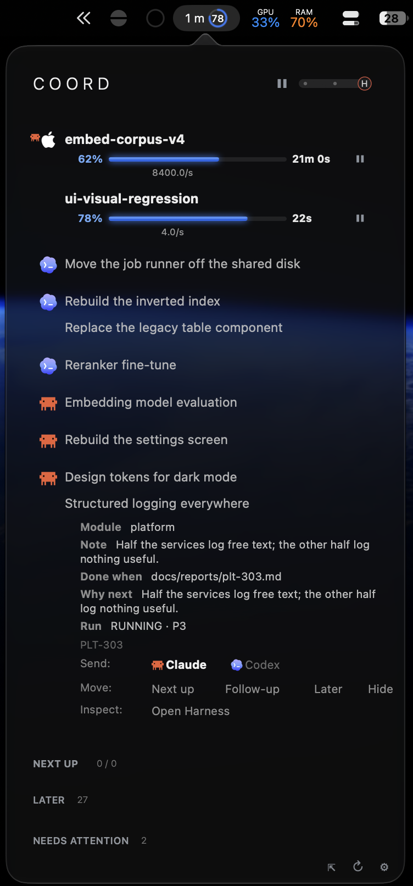</td>
<!-- S12 -->
<td width="50%" align="center">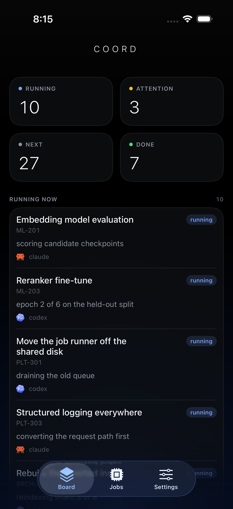</td>
</tr>
<tr>
<td valign="top"><sub><b>COORD</b> is the glance, and it has no Dock icon by design. The ring sits <b>in the menu bar itself</b> &mdash; the strip along the top of that capture &mdash; carrying elapsed time and percentage without opening anything.</sub></td>
<td valign="top"><sub><b>Coord Cockpit for iOS</b> is the same board away from the machine, on the same palette, accent, agent marks and derived status vocabulary as the desktop clients.</sub></td>
</tr>
</table>

There is no download. The apps are unsigned local builds — shipping a notarised
binary would mean an Apple developer identity in a public repository, which is
exactly the kind of thing this repository's extraction gate exists to keep out.

<details>
<summary><b>Build the macOS apps</b></summary>

**Requirements:** macOS 14 or newer, Xcode, and [XcodeGen](https://github.com/yonaskolb/XcodeGen) (`brew install xcodegen`).

```bash
cd apps && xcodegen generate
xcodebuild -project CoordCockpit.xcodeproj -scheme CoordMenuBar -configuration Release -derivedDataPath .build build
xcodebuild -project CoordCockpit.xcodeproj -scheme CoordCockpitWindow -configuration Release -derivedDataPath .build build
```

That produces `apps/.build/Build/Products/Release/COORD.app` and `COORD Cockpit.app`.
Run either directly, pointing it at a board:

```bash
COORD_DB=$PWD/.coordharness/coord.db COORD_BOARD_URL=http://127.0.0.1:7870 \
  "apps/.build/Build/Products/Release/COORD.app/Contents/MacOS/COORD"
```

| App | What it is | Where it appears |
|---|---|---|
| **COORD** | Status-bar panel: a progress ring in the menu bar, running work and local jobs in the popover, with pause and mode controls | The system menu bar — no Dock icon by design |
| **COORD Cockpit** | Full window: the Board plus embedded Mesh, Map, and Atlas views under one navigation | The Dock |

Both read the database directly through a read-only SQLite connection
(`SQLITE_OPEN_READONLY` plus `PRAGMA query_only=ON`) and fall back to the HTTP
snapshot. By default neither can write to the board. An explicit
`apps/install.sh --enable-native-operator-writes` opt-in enables only native task
reassignment over a fixed loopback endpoint, with an owner-only bearer,
confirmation, exact row/version/assignment-head fences, idempotent receipts, and
refusal while a claim or run is live. Browser actions remain read-only; the native
client never writes SQLite directly. Reading the
file directly couples these two apps to the SQLite schema; the iOS client and the
snapshot-only `CoordCockpitMac` target take `/api/v1/snapshot` over HTTP instead and
stay independent of it. See [compatibility](docs/compatibility.md).
`COORD_DB` chooses the board, `COORD_BOARD_URL` the map to embed, and
`COORD_MENUBAR_CONFIG` the panel's appearance. Exact targets and the iOS client are
documented in [native clients](docs/native-clients.md).

</details>

### Web control room

The board server binds loopback only and serves read-only projections of the same
lifecycle authority. The Content-Security-Policy admits no inline script or style.
**This is not safe to expose to a LAN or the internet.**

---

## Maturity at a glance

The machine-readable source for this table is [`docs/feature-status.json`](docs/feature-status.json). "Preview" means source exists in this branch but its public contract can still change.

| Capability | Status | Public contract |
|---|---|---|
| SQLite-WAL lifecycle, claims, leases, proof, events | **Shipped** | Stable local core |
| `coord` CLI and Python API | **Shipped** | Stable core surface |
| MCP stdio server | **Preview** | 34 tools declared, 33 exposed by default; fresh generic preflight, board, and lifecycle writes answer, while `facts_lookup` and `orient` fail closed until a knowledge store and an enforced exact-authority policy exist; strict-profile custody remains deployment-specific |
| `coord-mcp` executable | **Preview** | Packaged stdio launcher; the checked-in project-scoped configs use paths relative to the project root, and absolute paths are required whenever the client does not launch the server there |
| Local jobs and run telemetry | **Shipped** | Library surface; CLI is preview |
| Bounded context, facts, and full-text retrieval | **Preview** | The capsule, digest, skeleton, focus, search, and curation lenses render on a fresh generic `coord.db`; the MCP server names the fact ledger on every read but does not create it, and knowledge indexing and accepted-memory bootstrap remain library workflows |
| `coord doctor` safety report | **Shipped** | Read-only stable v1 PASS/BLOCKED contract; exits 0 on a freshly seeded board and after a completed claim |
| Codex and Claude project skill packages | **Shipped** | Byte-identical repository integration |
| Local MLX model orchestration | **Preview** | Explicit catalog, preflight, and process-held resource lock |
| Source-bound graph views (Board, Mesh, Map, Atlas) | **Preview** | Read models over one bounded authority; never a freeform whiteboard or writer |
| Freeform shared whiteboard | **Planned** | No authoritative standalone implementation |
| Rich private-product operations console | **Excluded** | Product modules, branded actions, and hosted operations stay private |
| Loopback read-only web board | **Preview** | Branch surface; localhost only |
| macOS and iOS clients | **Preview** | Clean-room read-only clients by default; opt-in macOS task reassignment is loopback-only, authenticated, confirmed, and CAS-fenced |
| Distributed, hosted, or multi-tenant coordination | **Excluded** | Single-machine trust model |

## Security boundary

`coordharness` assumes trusted processes under one local user account. Actor and session labels are coordination identity, not cryptographic authentication. The database can contain work titles, event text, and local metadata; keep it out of source control and protect it with filesystem permissions.

- Do not bind the board beyond loopback.
- Do not share `coord.db` over a network filesystem.
- Do not put secrets, prompts, source bodies, argv, or stdout in events or sidecars.
- Do not treat read-only clients as authorization boundaries.
- Run the publication gate before any external release.

Read the full [security and privacy model](docs/security-and-privacy.md) and [security policy](.github/SECURITY.md).

## Documentation

| Start here | Then |
|---|---|
| [Getting started](docs/getting-started.md) | [Coordination model](docs/coordination-model.md) · [Agent protocol](docs/agent-protocol.md) |
| [Standalone setup](docs/standalone-setup.md) | [MCP integration](docs/mcp-integration.md) · [Security and privacy](docs/security-and-privacy.md) |
| [Architecture](docs/architecture.md) | [Data model](docs/schema.md) · [Context architecture](docs/context-architecture.md) |
| [MCP integration](docs/mcp-integration.md) | [MCP server reference](docs/mcp-server.md) |
| [Operators' handbook](docs/operators-handbook.md) | [Jobs and runs](docs/jobs-and-runs.md) · [Local models](docs/local-models.md) |
| [Visual atlas](docs/visual-atlas.md) | [Operations Atlas contract](docs/operations-atlas.md) · [Swarm Mesh](docs/swarm-mesh.md) |
| [Security and privacy](docs/security-and-privacy.md) | [Governance](docs/governance.md) · [Releasing](docs/releasing.md) |

Contributing guidance is in [CONTRIBUTING.md](.github/CONTRIBUTING.md); COORD-Harness is released under the [MIT License](LICENSE).

---

<details>
<summary><b>Visual index</b> &mdash; every figure on this page, numbered</summary>

Reference a figure by its number to cut it, move it, or swap it. Diagrams are `D#`,
screenshots are `S#`, and each number appears as an HTML comment directly above its
figure in the source, so `grep -n "S7" README.md` finds it instantly.

| # | File | Section | What it is for |
|---|---|---|---|
| **S1** | `screens/macos-cockpit.png` | Hero | The work table, native — the surface an operator lives in — before any prose |
| **S2** | `screens/swarm-mesh-context.png` | Intro | The fleet as one coherent spatial read, shortly below the primary Cockpit hero |
| **D1** | `birdseye.svg` | Intro | One authority, many read-only projections |
| **D2** | `single-authority-flow.svg` | Two agents, one file | CLI/MCP/Python converge; no client-to-client sync |
| **D3** | `handoff-sequence.svg` | Handing work over | Handoff is an ownership transaction; the refusal proves it |
| **D4** | `multi-agent-jobs.svg` | Why a swarm is one row | Subagents roll up; job lanes |
| **S3** | `screens/board-overview.png` | What an operator sees | Attention and running work |
| **S4** | `screens/operations-atlas-overview.png` | What an operator sees | One coherent generation, joined |
| **S5** | `screens/map-fleet.png` | Lens gallery | Who is working where |
| **S6** | `screens/map-deps.png` | Lens gallery | Downstream reach and longest walk |
| **S7** | `screens/map-chronicle.png` | Lens gallery | Precedence without a clock |
| **S8** | `screens/map-pulse.png` | Lens gallery | The record as a live wire |
| **S9** | `screens/map-ceiling.png` | Lens gallery | Bounded parallelism thought experiment |
| **S10** | `screens/map-topology.png` | Lens gallery | The fleet as an org in motion |
| **D5** | `lifecycle.svg` | How work moves | Intent vs observed state; the proof gate |
| **D6** | `jobs.svg` | How work moves | Tracked processes and liveness re-derivation |
| **D7** | `context-retrieval.svg` | What the harness remembers | Authority vs bounded retrieval vs recall |
| **S11** | `screens/macos-panel.png` | Native | The menu-bar glance |
| **S12** | `screens/ios-home.png` | Native | The same board on a phone |

**Deliberately not on this page**, still in `docs/assets/` and reachable from the
deeper documents: `board-work.png` (the same work table as **S1**, in the web console instead of
native — the native section now says that in one sentence instead of showing it
twice); `handoff.svg` (superseded by **D3**, which shows the same transaction
*and* its refusal); `architecture.svg` and `system-architecture.svg` (two
overlapping views of one actor model — one belongs in
[architecture](docs/architecture.md), not here); `context.svg`, `context-tiers.svg`,
`lifecycle-proof.svg`, `projection-topology.svg`, `extraction.svg`; the remaining Map
lenses `map-shape`, `map-subjects`, `map-orbit`, `map-crossings`, `map-context`,
`map-search`, `map-drawer`, `map-flowpath`; and `board-jobs`, `board-graph`,
`board-activity`, `operations-atlas-topology`, `swarm-mesh-critical`,
`swarm-mesh-owners`, `swarm-mesh-traversal`, `swarm-mesh-mobile`.

</details>
