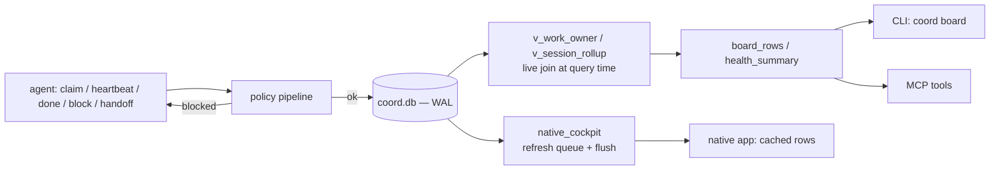

# Architecture

`coordharness` coordinates a fleet of agents — Claude sessions, Codex sessions,
a local model doing batch inference, a background script running a migration —
against one shared unit of work: a project repository. None of these
processes share memory or a runtime. What they share is a file on disk and a
small set of rules about how to write to it. This document is the map: the
four moving parts, how a write reaches the board, and what happens when an
agent doesn't come back.

## The four moving parts

1. **The board** — `coord.db`, a single SQLite file in WAL mode, holding
   sessions, work items, claims, runs, and an events log. The only place
   state actually lives.
2. **The lifecycle verbs** — a fixed vocabulary (`claim`, `heartbeat`, `done`,
   `block`, `park`, `handoff`, ...) that agents use to change what the board
   says. Every verb runs through the same policy pipeline before it writes
   (see [`policy-pipeline.md`](policy-pipeline.md)).
3. **The projection / read model** — SQL views and a cached snapshot table
   that turn raw rows into "what's running right now," computed at read time
   rather than trusted from what was last written.
4. **The clients** — a `coord` CLI for scripts and terminal use, an MCP
   server so an agent calls coordination tools directly instead of shelling
   out, and a native desktop app that reads the cached snapshot to show a
   live board without touching SQL itself.

Everything below explains how those four pieces fit together.

## The board: why SQLite in WAL mode

The obvious alternative to a shared file is a small server — something with an
HTTP API that every agent talks to. That was rejected for the case this
package targets: several agent processes on the *same machine*, against the
*same checkout*, for a session that might last minutes or might last all day.
A server is one more process to keep alive, and one more piece of
infrastructure a contributor has to stand up before they can try the tool.

SQLite's default journal mode does not fit this either — a writer holds an
exclusive lock on the whole file, so one agent mid-claim blocks every other
agent's read. WAL (write-ahead logging) changes that: writers append to a
separate log instead of the main file, and readers keep reading the last
consistent snapshot while a write is in flight. Several agents can hold
connections to the same `coord.db` at once — some reading the board, one
appending a claim — without the readers blocking on the writer or each other.
`connect()` turns this on explicitly, with a five-second busy timeout so a
momentary lock conflict retries instead of raising, and
`synchronous = NORMAL`, the standard WAL pairing: durable against a process
crash, not against the OS crashing mid-write, an acceptable trade for a log
that isn't the system of record for anything external.

The cost is worth naming: SQLite-over-a-shared-file does not extend across
machines. Every agent in scope for this package runs on one box against one
filesystem; a fleet spread across hosts would need a different board.

## Lifecycle verbs, and the two guards

An agent's relationship to a piece of work moves through a small state
machine: `queued` → claimed and `running` → `done` (or `blocked`, or
`parked`, with a way back to `running`). Each transition is one function
call, wrapped in a transaction, and each is gated by two checks that exist
specifically so the board can be trusted rather than merely believed.

**A claim on assigned work has to come from the assignee.** Work can carry an
`assignee` — a specific actor it's earmarked for. If a session belonging to a
different actor tries to claim it directly, the claim is refused; moving work
across actors requires a typed handoff, a separate operation that records who
handed off to whom and why, rather than a plain claim quietly taking over
someone else's row.

**Completion requires a claim and declared proof.** A work item
declares its own proof of completion up front — a `done_signal`, typically a
path to a file the finished work is supposed to produce. Marking it done is
refused unless the caller currently holds a live claim, the explicit proof
matches the controller-declared path, the proof exists and passes custody
validation, and terminal/review guards permit completion. Markdown proof must
be tracked by Git's current index. Staging is sufficient for this custody gate;
a commit is not required.

```
$ coord claim PAY-101 --step "tracing the refund path"
{"ok": true, "claim_id": "clm_...", "work_id": "PAY-101", ...}

$ mkdir -p docs/reports
$ printf '%s\n' '# Synthetic proof' > docs/reports/settlement-reconciler.md
$ git add docs/reports/settlement-reconciler.md
$ coord done PAY-101 --artifact docs/reports/settlement-reconciler.md
{"ok": true, "work_id": "PAY-101", "artifact": "docs/reports/settlement-reconciler.md"}
```

Both guards are exercised end to end in `tests/test_lifecycle_smoke.py`
against the seeded demo board (`coordharness.demo`) — a small fictional
payments-service port, invented so the tests and this document have
something concrete to point at.

## The derived-status principle

No row in `coord.db` has a column that says `status = "running"`. That is
deliberate, and it is the one idea that shapes the rest of the schema.

A stored status is a claim an agent made in the past and nobody has since
revisited. If the process behind it dies — killed, crashed, laptop closed —
the stored value keeps saying "running" forever, because updating it was the
dead process's job and it can't do that job anymore. A status field with no
automatic path back to the truth degrades monotonically: the longer it sits,
the more likely it is wrong.

`coordharness` computes status instead of storing it, every time it's asked.
`work_items` records *intent* (`queued`, `running`, `blocked`, ...) — what an
agent last declared it was doing — but the board's actual displayed status is
derived by joining that intent against two live signals at query time: is
there a claim on this work whose lease hasn't expired, and is the process
behind it still the process that took it (checked by PID *and* process start
time together, so a reused PID from an unrelated process doesn't count as a
match). `v_work_owner`, the view underneath every board read, does this join;
`bucket()` in `projection_schema.py` then folds the raw states into the small
vocabulary a UI needs (`running`, `blocked`, `queued`, `done`). A row whose
claim has quietly expired doesn't get corrected by a background job before
you can trust it — it's already correct on the next read, because "correct"
was never a value sitting in a column to go stale.

## Leases, and what happens when an agent dies

Every claim and every session carries a lease — an expiry timestamp, an hour
out by default. Holding the claim means renewing that lease with a heartbeat
before it lapses; nothing else keeps a claim alive. If an agent disappears
mid-task — its process is killed, its chat is closed, its host loses power —
nobody sends `release`, and none is needed.

Two independent mechanisms notice. First, purely at read time: the join
described above checks the claim's expiry against "now," so a lapsed lease
stops showing as `running` on the very next board read, before anything has
run to clean it up. Second, a periodic reaper (`reap_zombie_sessions`,
`release_expired_claims_batch`) does the bookkeeping: it flips expired claims
to `unclaimed` and — unless the work item has since been explicitly blocked
or paused — puts the item back to `queued` so another agent can pick it up.
A run process that dies without releasing its claim is caught the same way
`reap_dead_runs` does it: `os.kill(pid, 0)` confirms the process no longer
answers, or it never checked back in (`heartbeat_at`) within its own
staleness window, and it's marked `orphaned`. None of this requires the
crashed agent to have done anything right on its way out — the guarantee
comes from the board checking, not from being told.

## Subagents and background runs: rollup, not one-row-per-child

An agent frequently isn't one process. A session might spawn several
subagents to work a problem in parallel, or launch a long batch job as a
detached run and keep going. None of that should turn into a wall of rows on
the board that a person has to mentally group back together.

Every session and every run can carry a `parent_session_id`. A subagent
registers under the session that spawned it; a background run does the same.
The board's session view, `v_session_rollup`, only surfaces sessions with no
parent — the top-level session a human or another agent would recognize —
and rolls the rest into two counts on that one row: child sessions, child
runs. A fleet of twelve subagents chasing one investigation reads as one
parent row with `child_sessions = 12`, not twelve rows competing for
attention. The work item they're all serving stays a single row too; child
claims and runs are what the parent's row summarizes, not siblings of it.

## The projection and the clients

Two read paths exist for the same state, because "compute status live" and
"show a board that renders continuously with no lag" pull in slightly
different directions.

`board_rows()` and `health_summary()` query `v_work_owner` directly, at the
moment they're called — no caching, correct by construction as of the
instant of the read. The CLI's `coord board` and the MCP server's
board-reading tools use this path.

A native desktop client would rather not run that join on every frame. For
that case, `native_cockpit.py` maintains a separate snapshot: lifecycle
writes that change enough to matter request a refresh (`request_refresh`),
and a flush step recomputes the projection into a plain row table, guarded by
a file lock so two flushes never race. The native app just reads rows — no
SQL, no view logic of its own — trading a small amount of staleness (bounded
by how promptly a flush runs) for a read that costs nothing per frame.



The three clients differ in shape but never in authority: the CLI is a thin
argument parser over the same functions in `coord_db.py` that everything else
calls; the MCP server exposes a curated subset of those functions as typed
tools so an agent calls `claim_work` directly instead of shelling out; the
native app never writes at all — it only reads the cached projection. None of
the three holds state of its own. `coord.db` does, and every one of them
reduces to reading or writing it through the same narrow set of functions
this document has described.
