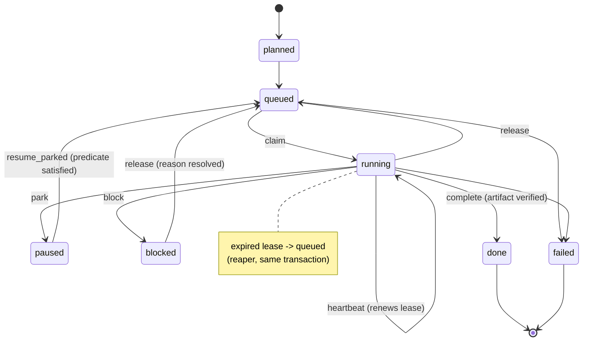

# The coordination model

If you run more than one coding agent against the same codebase — a couple of
Claude sessions, a Codex session, a background batch job — you eventually hit
the same three problems. Two agents pick up the same piece of work at once.
An agent says a task is "running" long after the process that was running it
died. An agent says a task is "done" and there is nothing on disk to show for
it. `coordharness` is a small control plane that exists to make those three
things structurally hard to do by accident.

The mechanism is a single SQLite database (WAL mode, one writer at a time)
that everyone reads and writes through a typed API — a Python library
(`coordharness.coord.coord_db`), a CLI (`coord`), and an MCP server that
exposes the same operations as tools an agent can call directly. Nothing about
the model depends on which of those three surfaces you use; they all end up
calling the same functions in `coord_db.py`.

This document covers the conceptual model: how work is organised, what each
lifecycle verb actually writes, how a claim's status is derived rather than
declared, and why completion requires a real artifact rather than an agent's
say-so.

## Three levels of work, one unit of ownership

Work is organised in three tiers:

- **Initiative** — the umbrella. A large piece of work with a title and a
  handful of children, but nothing anyone claims directly.
- **Job** — the assignable unit. This is the thing an agent claims, works,
  and completes. One job is one row on the board.
- **Task** — a step inside a job, tracked as a child row when it needs its
  own state, or as a note/milestone on the job when it doesn't.

In the schema this is one table, `work_items`, with a `surface` column
(`epic | job | task`) and a `parent_id` that points a child at its parent.
There is no separate table per tier — an initiative and a job are the same
kind of row, distinguished by whether other rows point at it as a parent and
whether anything ever claims it directly. The practical rule the schema
documents is: **one JOB equals one assignable claim equals one board row.**
If a piece of work is substantial enough to track, it gets its own job row;
sub-steps of that job roll up under it rather than spawning a parallel
umbrella row that hides what actually happened.

A parent/child edge is validated on write: a row cannot become its own
parent, and the chain is walked to reject a cycle before it's stored. A job
can also declare `depends_on` — other work_ids that must be dealt with first
— which is validated the same way.

## Claiming work: one held claim per row

To work on a job, an agent claims it:

```python
claim_id = coord_db.claim_work(conn, session_id, work_id, step="tracing the refund path")
```

A claim is a separate row, in a separate table, from the work item it points
at. This split is what makes the "who is doing this, right now" question
answerable without trusting a flag: a work item's `intent_state` records what
the last writer *declared* (`planned`, `queued`, `running`, `blocked`,
`done`, ...), but the schema enforces, with a partial unique index, that a
work item can have **at most one held claim** — one row in `claims` whose
`status` is `running`, `paused`, or `blocked` — at a time. `paused` and
`blocked` still hold the slot: the work is owned, just suspended, so a second
agent cannot grab a running claim out from under a session that stepped away.
Trying to claim work already assigned to another agent's lane fails outright
— it has to go through a typed handoff (below), not a second claim.

Every claim carries a lease (`expires_at`), refreshed by heartbeats. Before a
claim is granted or refreshed, the harness sweeps any claim on that row whose
lease has already expired: it flips the claim to `unclaimed` and — in the
same transaction — resets the work item back to `queued`, unless the item was
deliberately parked or blocked (which sticks). That sweep is why a `running`
intent_state can't quietly outlive its process for long: nobody has to notice
the staleness and fix it by hand, because the very next read or write that
touches the row repairs it. A separate batch pass, `release_expired_claims`,
does the same sweep across the whole board on a schedule, and
`reap_zombie_sessions` does the equivalent for a whole session — when an
agent's process is confirmed dead (no matching pid, or an operator names the
session), every claim it held is released, any live runs it owns are marked
`orphaned`, and the session itself is marked `reaped`. This is the sense in
which **status is derived**: nothing in the API lets a caller just write
`status = "running"` into a row and walk away. A row is running because a
live, unexpired claim says so, and that claim is checked and, if necessary,
corrected on every touch.

Default lease length is one hour (`LEASE_DEFAULT_S = 3600`); a shorter
900-second lease is available for work that wants tighter liveness checking.
Reaping gives a 60-second grace period past expiry before it acts, so a
slow heartbeat under momentary load isn't mistaken for a dead session.

## The verb reference

All of these are typed operations against the same database; the numbers in
parentheses are the table/column they touch.

| Verb | What it does | When to use it |
|---|---|---|
| **claim** | Inserts (or resumes) a `claims` row in `running` status with a fresh lease; sets the work item's `intent_state` to `running`. | Starting work on a job that is `queued` or `planned`. |
| **heartbeat** | Extends `expires_at` on an existing `running` claim. Refuses to extend an expired or non-running claim — the caller has to reclaim explicitly instead. | Long-running work, called well before the lease would expire. |
| **release** | Sets the claim's status (`released`, `unclaimed`, `paused`, or `blocked`) and, for `released`/`unclaimed`, frees the row back to `queued`. | The general-purpose "I'm done holding this, for whatever reason" verb — `park` and `block` are convenience wrappers around it. |
| **park** | `release` with `status="paused"`. Requires a `next_step` and a `resume_when` — the harness refuses to park work with no stated way back in. | Work that's paused on purpose, waiting on something else to finish. |
| **block** | `release` with `status="blocked"`, plus a non-empty reason. The reason is expected to name one of a fixed set of blocking classes (missing spec, awaiting review, external dependency, and so on), so a blocked board can be triaged by class rather than read one row at a time. | Work that cannot proceed without someone or something else acting first. |
| **complete** (`done`) | Validates a real artifact exists at the job's declared `done_signal`, records it in `artifacts`, flips the claim to `completed` and the work item to `done`. | Finishing a job — see the next section, this is the one with teeth. |
| **handoff** (`handoff_existing`) | Reassigns a work item to another lane under an optimistic-concurrency contract: the caller must state the version, assignee, and event history it expects to be handing off from, and the write is rejected if any of that has drifted. | Moving ownership from one agent/lane to another — the only way to move work assigned to a different actor. |
| **note** | Appends an event of kind `note`, addressed to the other lane's mailbox. Does not touch the work item's state at all. | Leaving context for another agent without asserting anything about the work's status. |
| **audit** | Appends a typed event (`audit_request`, `audit_verdict`, etc.) with an optional verdict, severity, and evidence refs. | Requesting or recording a review of a specific piece of work. |
| **verdict** | A thin wrapper over `audit(kind="audit_verdict", ...)`, addressed back to the author's lane. | Recording pass/flag/blocked on work someone else claimed and finished. |
| **decision** | Appends an event of kind `decision` with a scope and an optional list of other work it binds, plus what would make it stale. | Recording a ruling that should constrain future work, independent of any one job. |

Every one of these operations runs through the same seven-stage policy
pipeline before it's allowed to land — a lint on the write itself, a check
for loop-like repeated failures, a token-budget check, a check that any
declared status is structurally valid, an output-size check, an event-emit
step, and a check against the set of tools the caller is allowed to use in
this context. A caller sees exactly which stage passed or failed; nothing is
silently dropped.

## Why completion needs a receipt, not an assertion

`complete` is the one verb that is deliberately hard to satisfy. Calling it
does four things, in order, inside one transaction:

1. Confirms the caller actually holds a live, unexpired, `running` claim on
   the row (you cannot complete work you're not holding).
2. Confirms there is no unresolved negative review and no run still executing
   against this work.
3. Resolves the job's controller-declared `done_signal` — a path, set when
   the job was created — and requires any explicit artifact path to match it.
4. Applies custody validation to reject empty, incomplete, telemetry-shaped,
   or otherwise non-proof artifacts before writing the terminal receipt.

For done-signals of every artifact type -- except the few kinds that structurally
cannot live in a git index -- the implementation requires the proof path
to be tracked by Git's current index. Staging with `git add` is sufficient; a
commit is not required. A deployment that needs commit-pinned custody should
add that stronger condition as acceptance or policy and bind the commit identity
explicitly. A caller still cannot complete without holding the live claim and
satisfying the exact declared proof.
Artifact kinds have shape-specific checks: a database table must resolve, and
JSON or Parquet must clear non-triviality checks. Existence proves only the
local proof contract; it does not by itself establish version-control,
deployment, or external provenance.

There's a second check on the same artifact: the harness scans the first
dozen lines of a Markdown done-signal for a self-declared status like
`VERDICT: NOT_READY` or `STATUS: BLOCKED`. If the artifact itself says the
work isn't finished, `complete` refuses to contradict it — block or park the
work instead of completing over a document that says it shouldn't be.

## Blocked and parked are different failures

Both `block` and `park` suspend a claim without releasing the row, and both
go through the same `release` machinery underneath. The difference is what
they're claiming about the future:

- **Parked** work has a concrete way forward that the parking agent already
  knows: a `next_step` and a `resume_when` are mandatory, and can optionally
  carry a typed, machine-checkable `resume_predicate` — "resume once event N
  has posted," "resume once this path exists," "resume once a verdict has
  been posted from the other lane," or a boolean combination of those. When a
  predicate is attached, the work sits in `queued`/`planned` but cannot
  actually be claimed until the predicate has been observed true at least
  once (`continuation_ready_at` gets stamped the first time it evaluates
  true) — so a parked row with a predicate can't be picked up prematurely by
  someone who didn't check the condition themselves.
- **Blocked** work is missing something the blocking agent does not control
  — a specification, a dependency, a review, an external input — and the
  block reason is expected to come from a fixed vocabulary of blocking
  classes rather than free text, so a blocked board can be triaged by class.

Resuming parked work (`resume_parked_work`) is itself guarded: the caller
must be the assignee, must supply a reason and evidence references, must
match the row's current version (optimistic concurrency — if the row moved
since the caller last read it, the resume is rejected rather than silently
overwriting), and the operation is keyed so a retried call replays the
original result instead of resuming twice.

## A job's life



`done`, `failed`, `archived`, and a handful of other terminal states are
sinks: nothing can claim, park, or block a row once it's in one of them —
`claim_work` rejects it outright, by design. Getting there requires going
back through the board (a new job, a correction event), not reopening a
closed row.

## What this doesn't cover

This document is the conceptual model, not the full API surface. It doesn't
cover the review-tier machinery that decides which completions need an
independent verdict before `complete` will accept them, the write-set
declaration mechanism that lets concurrent claims detect when they're about
to edit the same files, or the projection layer that turns this database
into a dashboard. Those are worth their own documents. What's here is
sufficient to answer the two questions that matter first: what does it mean
for a piece of work to be "in progress," and what does it take to
legitimately say it's finished.
