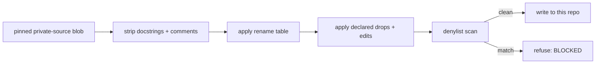

# Extraction: how this repository was separated from a private codebase

`coordharness` is not a project that started here. It was cut out of a private, commercial
monorepo that has nothing to do with agent coordination as a product — coordination was one
internal subsystem inside a much larger, domain-specific codebase. This document describes the
tool-driven process used to separate the two, and how a contributor keeps the separation intact.
If you are extracting your own internal tool from a private codebase, the approach here may be
more directly useful than the code itself.

## The problem with the obvious approach

The obvious way to split a subsystem out of a monorepo is a history filter: `git filter-repo`,
`git subtree split`, or similar, run against the paths you want to keep. That was rejected,
because history is itself a leak surface, not just the working tree at HEAD.

- **Author identity.** Every commit in a filtered history still carries the real author's name,
  email, and the pattern of who touched what, when — none of it belongs in a public repository.
- **Deleted-but-reachable blobs.** A file added and deleted three commits later is *gone from HEAD*
  but still sitting in the pack, reachable with `git log --all` or `git cat-file`. A path filter
  does not chase those down; a determined reader does.
- **Commit messages.** These are prose, written for an internal audience, about internal decisions.
  "Fixed the retry loop after the outage in the billing reconciliation job" names a real incident,
  and a history filter keeps the message along with the commit.

The fix was to not carry history at all. This repository began with a fresh `git init`. Every
commit here was made against already-ported, already-reviewed content — no ancestor commit
anywhere in this repository ever touched the private codebase's source tree. That is a stronger
guarantee than any filter can offer, and it costs nothing but the loss of the original commit
history, which was never the point of open-sourcing this tool.

## Port mechanism, regenerate prose

The harder problem is the working tree itself. The private codebase's confidential content —
which customers it serves, what its data pipeline is called, which internal decisions shaped a
given function — did not live in a separate secrets file that could be excluded by path. It lived
in ordinary prose: docstrings, inline comments, string literals in test fixtures. The *code* — the
state machine, the SQL, the CLI wiring — was already generic. The *English around it* was not.

That rules out the tempting shortcut of "copy the file and redact the bad words." A wordlist-based
redaction is a guard scoped by the vocabulary it already knows about: it catches a domain term you
thought to list and says nothing about the one you didn't — a customer name in a comment, an
internal codename, a colleague's name in a "TODO: ask X" note. Such a guard can only fail on
vocabulary it already knows about, which makes it a guard against imagined disclosures, not
disclosure itself.

So the extraction does not try to detect and remove confidential prose. It removes *all* prose,
unconditionally, and documentation is regenerated fresh against the result. For every Python file
brought across, the porter first reads the exact regular-file blob from the commit pinned in the
private manifest. It never trusts mutable working-tree bytes. The transform then:

1. Every docstring is deleted — module, class, and function level — using the AST, not a regex, so
   a docstring containing something that looks like code is not mistaken for code.
2. Every comment is deleted, using the tokenizer, with two exceptions: a shebang line and an
   encoding declaration, since those change how the interpreter reads the file, not what it says.
3. What remains is renamed. An explicit, ordered table of pattern → replacement rewrites the
   private codebase's package name, environment-variable prefix, module paths, and bundle
   identifier into this project's equivalents. Order matters: a specific rule for a nested module
   path has to run before the general rule for the bare package name, or the general rule eats the
   specific one's prefix first and leaves a mismatched rename behind.
4. Declared drops and literal edits run with exact cardinality. A partially named chained or
   destructuring assignment is rejected instead of silently deleting co-targets that were never
   approved.

What's left is mechanism with no inherited English in it: a class with no docstring, a conditional
with no comment explaining the business reason for the branch, calling a renamed environment
variable. Documentation in this repository — including this file — was written fresh against the
standalone behavior rather than copied from the private source prose.



A second-line denylist still runs over the output — patterns for absolute home paths, internal
work-item IDs, credential-shaped tokens, email addresses, and the handful of domain terms specific
to the source product. It catches real things. But it is documented in the tool's own source as
the second line of defence, never the first, because a pattern list has the same blind spot a
wordlist redaction would have had. Removing *all* prose does the actual work; the denylist is a
check on the check.

## The manifest: an allowlist, not a copy

No directory is ever copied wholesale into this repository. Every ported file is listed
individually in a non-published reproduction manifest, with a source path, a destination path, and
a one-line reason it belongs here. Its safe public projection is
`tools/extract/manifest.json`: destination, generalized reason, and transform counts/reasons only;
it intentionally omits private source paths, edit literals, and dictionary-testable fingerprints
of either. Glob patterns are rejected outright by the loader — a manifest entry containing `*`,
`?`, or `[` is a hard error before anything is read.

A directory-shaped rule doesn't know what it's copying. `cp -r` or a glob-driven build step will
happily pull in a stray `.pyc`, a symlink into a private data store that resolves to gigabytes of
real records, or an editor swap file. None of those show up as code changes in a diff — they're
new files — and a manifest entry is what makes a new file's presence a deliberate decision instead
of an accident of the file system.

Two smaller mechanisms sit inside the manifest for what prose-stripping and renaming don't reach.
**Declared symbol drops** name top-level constants or tables that survived stripping because they
were *data*, not prose — string literals naming internal identifiers, a lookup table of the source
product's own subsystem names. Each name is listed per file under `drop_symbols`, and the porter
deletes the whole assignment, function, or class bound to it. **Declared literal edits** name
one-off string replacements — a hardcoded path, a pointer to an internal report — as explicit
find/replace pairs per file. Both fail loudly rather than silently if the declared name or text is
never found in the source, since that usually means the source moved and the edit needs re-review.
Both exist so every removal beyond "all prose" is a line in a JSON file a reviewer can read and
agree with, rather than a regex that might match something unintended on the next file.

## The gate: five checks over exact Git objects

Before anything is published, `tools/extract/gate.py` inventories the exact Git candidate and
runs five independent checks. Candidate bytes come from staged blob object IDs, not from files
that happen to be visible in the working tree. Fidelity source bytes likewise come from the
private manifest's pinned commit. This closes two otherwise subtle time-of-check gaps: a dirty
private checkout cannot change the supposed source, and sanitized unstaged bytes cannot hide an
unsafe staged blob.

The gate is built the same way the porter is: as an allowlist over what's present, not a denylist
of what's forbidden, because a denylist reports clean for every category nobody thought to add
to it.

| Check | Verifies | Failure means |
|---|---|---|
| **coverage** | Every path in the staged candidate is in the port manifest, `authored.json`, or the short infrastructure list. | An undeclared build artifact, editor file, or change with no recorded origin. |
| **fidelity** | Each ported destination exactly equals a fresh transform of its regular-file blob at the pinned private commit. | The declared transform no longer explains the candidate or its frozen source lineage. |
| **patterns** | Credential, identity, home-path, private-domain, and related patterns are checked against exact staged bytes. | A directly authored or transformed file still contains a forbidden disclosure shape. |
| **shape** | Entries are regular files of bounded size and valid UTF-8, except provenance-registered PNGs that pass strict signature, chunk, CRC, metadata, and trailing-byte checks. | A symlink, malformed binary, hidden metadata carrier, bytecode artifact, or oversized file could evade ordinary text review. |
| **history** | Every reachable path, blob, commit message, author, and committer passes the release rules. | Sensitive content or identity remains reachable even though the final tree looks clean. |

Run `python tools/extract/gate.py` for coverage, patterns, and shape — checks that need only this
repository. Fidelity needs the authorized source root, private manifest, and private vocabulary;
without them the gate reports that check as skipped rather than silently claiming a pass it never
performed. A contributor without the original private repository cannot run fidelity, by design.

After the candidate has its final clean commit, add `--history` to scan all reachable release
history. The private pre-release operator runs both optional checks:

```bash
python tools/extract/gate.py \
  --source-root /path/to/the/private/repository \
  --source-manifest tools/extract/manifest.private.json \
  --vocabulary tools/extract/vocabulary.json \
  --history
```

Coverage, patterns, and shape are CI-enforceable on every contribution. Fidelity is a custody
check for the maintainer who holds both repositories. History is a final-release check, not a
substitute for constructing a fresh public lineage.

Only the complete private-source plus history run may print `PUBLISHABLE`. An exit-zero subset
means **gate-clean candidate**, not automatic publication: rights, license, maintainer approval,
and the intended repository visibility remain separate decisions. Anything else means stop; the
tool prints failures grouped by check.

## Receipts instead of remembered counters

Extraction counts change as the generic harness grows, so this document does not preserve a stale
snapshot as if it were a permanent product fact. The porter emits a machine-readable receipt for
each run, the publication gate prints its exact candidate count and per-check results, and the
release workflow records Python, clean-wheel, dependency, documentation, macOS, and iOS evidence.
Those generated receipts — not a number copied into prose months earlier — answer what was tested
for a particular release.

The invariant is stable even as the totals move: every candidate path has one declared origin;
every ported byte is reproducible from a pinned blob plus reviewed transforms; every intentional
post-port extension has a reviewed content hash; and no enabled gate may be skipped while still
being described as passed.

## Keeping it clean from here

Nothing about this is a one-time cleanup. The manifest, the denylist, and the gate are checked-in
artifacts so the next change to this repository is held to the same standard as the original port.
A new source file has to appear in `authored.json` with a reason, the same as a ported file has to
appear in `manifest.json` with one. Run the gate before opening a pull request; treat a failure as
something to fix, not a check to route around. If a check ever needs weakening to let a specific
file through, that is worth a second pair of eyes before the exception is made, not after.
