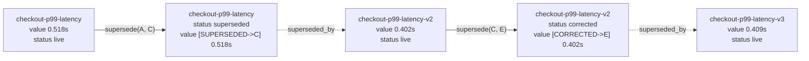
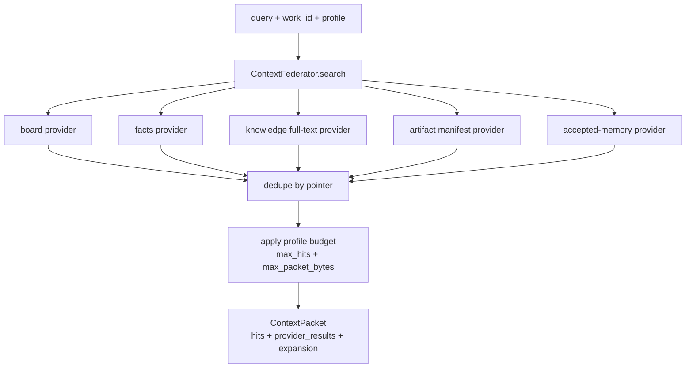
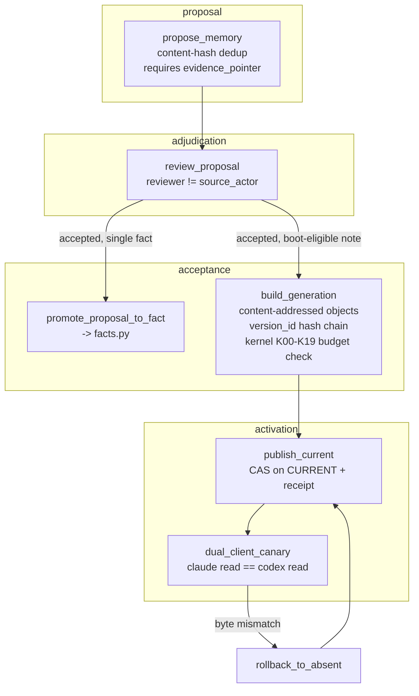
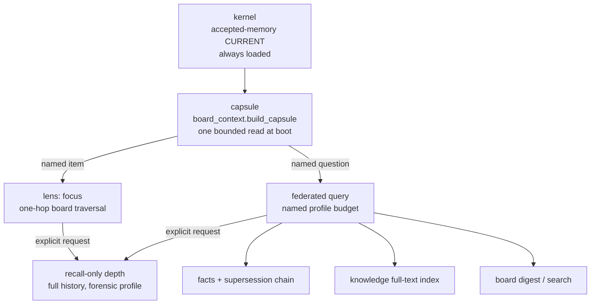

# The graph and the context it feeds

> **Maturity: Generic reads supported; graph remains Preview.** Fresh generic
> `coord.db` capsule/lens entry points are accepted and explicitly labelled. Strict-profile
> reads retain repository-custody and exact-authority gates.

[`context-architecture.md`](context-architecture.md) covers the byte budgets: how a capsule stays
under 6,144 bytes, how a federated query picks a named profile, why `output_budget` is the backstop
under everything. This document covers a different question underneath that one: what is the *shape*
of the thing all those bounded reads are reading from?

The honest answer is that `coordharness` does not ship one graph engine. It ships several small,
independently-verifiable node-and-edge structures — a board of work items linked by parent/child and
claim relationships, a fact store linked by supersession, a version-chained memory store linked by
content hash — that share one discipline instead of one schema: **every edge names where it came
from, and nothing gets to assert a relationship it can't point back to.** That discipline is what
this document is actually about. It shows up differently in each structure — a foreign-key check
here, a hash comparison there, a filesystem read-back somewhere else — but it is the same idea
repeated: a pointer is not trusted because it looks well-formed, it's trusted because something
tried to resolve it and could.

## A lens is a bounded traversal, not a bounded dump

`board_context.py` calls its four read shapes "lenses" (`digest`, `focus`, `search`, `skeleton`),
and [`context-architecture.md`](context-architecture.md) already covers their row caps and
`expansion` pointers. Read as a graph, `focus <work_id>` is doing something specific: it is a
one-hop traversal outward from a single node.

```python
parent = by_id.get(target["parent_id"])
children = [r for r in rows if r["parent_id"] == work_id]
siblings = [r for r in rows if r["parent_id"] == parent_id and r["id"] != work_id]
related = search_rows(rows, search_query, seed=target, diversify=True)
```

Four edge kinds come back from one call: a hard parent edge, a set of hard child edges, a set of
sibling edges derived by sharing a parent, and a set of *scored* related edges — same-parent scores
above same-module, which scores above a shared token in an artifact path (`_score_row`). The first
three are structural and exact. The fourth is a heuristic, and `focus` labels it that way by keeping
it in a separately-named `related_open`/`related_done` field rather than blending it into the
structural set — a caller that wants only load-bearing edges can ignore the scored ones without
having to guess which entries in a merged list were guesses.

What doesn't exist, and is worth being direct about, is a shared `Edge` type. `focus` builds its
parent/child/sibling/related sets as ad hoc list comprehensions over `parent_id`, not as instances of
a `Edge(source, target, kind, source_ref)` dataclass reusable elsewhere. The *discipline* — every
relationship traces back to a concrete column or a concrete search score, nothing is inferred from
vibes — is real and enforced by what the code does, but it lives as convention repeated at each call
site, not as one type the compiler checks. A future pass that wanted a genuinely reusable graph layer
would start by promoting this from four similar-looking functions into one typed edge.

## Why an edge needs a source, not just a shape

A relationship that can't be traced back to something concrete is indistinguishable from a guess that
happened to be right once. The clearest place this shows up in shipped code isn't a graph API at
all — it's `coord_db.py`'s acceptance-repair path, which is the one place in the harness where a
write carries an explicit `source_ref` field and that field is checked, not just stored.

```python
source_rel = Path(clean_source_ref)
if source_rel.is_absolute() or ".." in source_rel.parts:
    raise ValueError("acceptance repair source_ref must be repo-relative")
source_candidate = root / source_rel
if source_candidate.is_symlink():
    raise ValueError("acceptance repair source_ref must not be a symlink")
source_path = source_candidate.resolve()
if source_path != root and root not in source_path.parents:
    raise ValueError("acceptance repair source_ref resolves outside source_root")
if not source_path.is_file():
    raise ValueError("acceptance repair source_ref must resolve to a regular file")
observed_source_sha = hashlib.sha256(source_path.read_bytes()).hexdigest()
if observed_source_sha != clean_source_sha:
    raise ValueError("acceptance repair source-sha mismatch: ...")
```

Six checks before the write is allowed: the pointer must be repo-relative (no absolute paths, no
`..` escapes), it must not resolve through a symlink, it must land inside the declared root, it must
be a real regular file — not a directory, not a pipe — and the bytes actually sitting at that path
must hash to the exact value the caller claimed. A `source_ref` that names a file that doesn't exist,
or that's moved since the caller looked at it, or that's a symlink pointing somewhere else entirely,
fails the write. Nothing downstream ever has to ask "does this pointer actually mean anything" — it
already couldn't have been written if it didn't.

The fact store applies the same idea more loosely: every `Fact` carries an `evidence_pointer` column,
but `upsert_fact` doesn't resolve it the way acceptance-repair resolves `source_ref` — a pointer to a
file that no longer exists is stored without complaint. That's a real gap, not a design choice with a
justification behind it, and it's worth naming here rather than implying the whole system verifies
every pointer it stores. The two behaviors — one path that resolves and hashes before writing, one
path that stores a string and trusts it — sit side by side in the same codebase, and the difference
between them is exactly the difference between "an edge with a source" and "an edge with a label that
looks like a source."

## The fact store: a correction is a new node, never an edit to the old one

`facts.py` is a small ledger, and its central move is that **nothing is ever overwritten into
looking retroactively correct.** A `Fact` row has a `status` (`live`, `superseded`, `corrected`,
`parked`, `closed`, `dark`), a `supersedes` pointer to the row it replaces, and a `superseded_by`
back-pointer filled in only once something *does* replace it. `supersede(old_id, new_id)` is the one
function that sets both sides of that link, and it refuses to run unless both rows already exist:

```python
for fid in (old_id, new_id):
    if not c.execute("SELECT 1 FROM facts WHERE id=?", (fid,)).fetchone():
        raise ValueError(f"no such fact: {fid!r}")
```

An edge between two facts can't be created pointing at a fact that isn't there yet — the same "resolve
before you link" discipline as the acceptance-repair `source_ref` check, applied to a foreign key
instead of a filesystem path.

The part that matters for anyone reading a stale fact is what happens to its *value*. `corrected` and
`superseded` rows don't get their `value` field cleared or replaced — `_mark_stale_value` prefixes it
in place:

```python
def _stale_marker(status, superseded_by):
    tag = "CORRECTED" if status == "corrected" else "SUPERSEDED"
    pointer = f"->{superseded_by}" if superseded_by else "->?"
    return f"[{tag}{pointer}] "
```

So a retired fact reads `[CORRECTED->checkout-p99-latency-v2] 0.518s`, not a blank or a deleted row.
Anyone who reads it — a search hit, a federated-query result, a stray reference in an old note —
sees both the old number and exactly which row replaced it, in the same string, with no extra lookup
required. This is the fact-store version of the harness's broader stance that a correction should
never erase the observation it corrects: what was believed, and when it stopped being believed, are
both facts worth keeping.

Underneath status, there's a second, quieter axis: `valid_from`/`valid_to` are *bitemporal* columns,
independent of `updated_at`. `updated_at` is transaction time — when the harness recorded the row.
`valid_from`/`valid_to` are valid time — when the statement was actually true in the world, which
isn't always the same moment. A fact backfilled from an old report can have a `valid_from` months
before the row was ever written, and closing that interval (`valid_to`) is how a fact becomes
"this was true, and then it stopped being true" without needing a `supersedes` chain at all — some
facts just expire, they don't get replaced by anything.



Every node in that chain stays queryable forever; `search_facts` and `already_decided` can both find
the retired rows on purpose, because "what did we used to believe, and when did that change" is
sometimes exactly the question being asked.

## The full-text layer: turning "has anyone already answered this" into one query

[`context-architecture.md`](context-architecture.md) already covers `kfts.py`'s mechanics — one FTS5
row per document section rather than per file, query normalization, alias expansion, staleness
penalties. The graph framing worth adding here: each indexed row is effectively a node with a
`pointer` (a `memory://path#section-slug` address) as its identity, and the index is what turns
"walk the whole document tree and read everything looking for this" into "run one query and get back
pointers, ranked." The full-text index doesn't replace the fact store's supersession chain or the
board's parent/child edges — it's a third, orthogonal structure, over prose instead of structured
rows, that the federated query below treats as just another provider to ask.

## The federated query: one question, several sources, one budget

`context_federator.py` is the piece that stops "check the board, then check the facts, then check
the docs, then check prior memory notes" from being four separate calls a caller has to remember to
make and reconcile by hand. A `ContextFederator` holds a list of providers — board rows, the fact
store, the full-text knowledge index, artifact manifests, accepted-memory notes, memory proposals,
optionally closed-out board history — and `search(query, work_id=...)` fans the same query out to
all of them at once.



Three things keep this from turning into "search everything, hope for the best": every provider call
is wrapped so one provider throwing doesn't fail the whole query (its failure lands in the packet's
`errors` list instead); hits pointing at the same underlying source get deduplicated before the
budget is applied, so five providers separately surfacing the same document don't burn the hit cap
five times over; and the budget itself is a **named profile** — `orient`, `brief`, `work`,
`edit-prep`, `impact`, `code`, `docs`, `deep`, `forensic` — picked once per use case instead of a cap
every caller has to remember to set. `forensic` is `manual_only`: building its config requires an
explicit `allow_manual=True`, so the widest, most expensive profile can never fire by accident on a
routine call.

Every hit returned is a pointer plus a short snippet — never a full document body. Reading one hit's
full text is a second, separate call (`read_context_pointer`), with its own smaller byte cap. Finding
something and reading all of it stay two different actions on purpose, same as `kfts.read_note`.

## The accepted-memory pipeline: turning a folder of markdown into a hash-verified boot object

This is the least-visible mechanism in the repo and the one most worth surfacing, because it answers
a question the rest of this document doesn't: once a fact or a lesson has been proposed, how does it
actually become something an agent boots with — and how does the harness know, with certainty rather
than trust, that the thing it hands two different agents at boot is byte-identical for both?

**Proposal.** `memory_proposals.py` is the front door. `propose_memory(kind, statement, evidence_pointer=...)`
writes a row keyed by a content hash of `(kind, statement, value, scope, source_work_id)`, so the same
proposal made twice collapses into one row with its `seen_count` incremented rather than creating a
duplicate — the store notices when something keeps getting proposed. A proposal must carry either an
`evidence_pointer` or a `provenance` block; a bare assertion with nothing behind it is rejected at
the door. A per-thread cap (five proposals per 24 hours) exists specifically so one noisy session
can't flood the review queue.

**Adjudication.** `review_proposal(id, status, reviewer)` moves a proposal to `accepted`, `rejected`,
`parked`, or `superseded`. The one rule enforced in code, not just by convention: the reviewer cannot
be the same actor who made the proposal (`source_actor`) — a proposal doesn't get to adjudicate
itself into memory. An accepted proposal can then be promoted directly into the fact store
(`promote_proposal_to_fact`), carrying its evidence pointer forward as the new fact's
`evidence_pointer`.

**Acceptance and generation.** For memory that needs to become part of the boot-time kernel rather
than a single fact row, `accepted_memory_r4.py` runs a heavier, git-object-store-shaped pipeline.
`build_generation` takes a source directory of accepted markdown notes plus a declaration file (each
note's plane, lifecycle, and whether it's boot-eligible), and for every note: reads it with a
stat-before/stat-after check that rejects a file that changed mid-read, hashes it into a
content-addressed object (`objects/<sha256>.md`), and computes a `version_id` that's itself a hash of
the note's semantic content plus its `previous_version_id` — so a note's edit history is a hash chain,
the same shape as a git commit graph, and an unchanged note across generations reuses its prior
version rather than minting a new one. A separate `kernel_source.md` is compiled into the actual
always-loaded boot text: a fixed sequence of twenty blocks (`K00`–`K19`) is required to be present, in
order, with no gaps, and the compiled kernel is rejected outright if it exceeds 15 KiB or fails to
compress below three-quarters of its own uncompiled input — a budget enforced by the compiler, not
requested of it.

**Activation.** A completed generation isn't live until `publish_current` moves a `CURRENT` pointer
to it, and that move is compare-and-swap guarded (`expected_current` must match what's actually
there) and receipted (every publish writes a signed, hash-identified receipt naming the old and new
generation). The harness's own live-activation script goes one step further before trusting a first
activation at all: it publishes, reads the kernel back through two independent reader identities
(`claude`, `codex`), deliberately rolls the pointer back to absent, verifies it's really gone,
republishes, reads both identities again, and only accepts the activation if all four reads — before
and after the rollback, for both clients — are byte-identical. It proves the undo path works *before*
trusting the do path, on every activation, not just the first one.



## How it composes into a boot capsule

None of the pieces above is meant to be read directly by an agent every session. `board_context.build_capsule`
is the thing an agent actually boots from, and it draws on this whole structure without exposing it:
the kernel text underneath a session's system prompt is the accepted-memory `CURRENT` generation's
`kernel.md`, byte-identical across agent identities by construction; the capsule's health summary and
resume intents are a bounded read of the board graph's current node states; going one hop deeper on
one item is `focus`, a graph traversal; asking a broader question is the federated query, budgeted by
profile; and asking whether something specific was already decided is a fact-store lookup that
returns the whole supersession chain, not just the newest link.



That's the answer to "where's the graph": not one visualized diagram, but a set of small structures —
board relationships, a fact supersession chain, a memory version chain — each cheap to traverse
because each edge was checked against something real before it was allowed to exist, composed
together by a capsule that reads a fixed-size slice of all of them and hands a session a pointer to
the rest.
