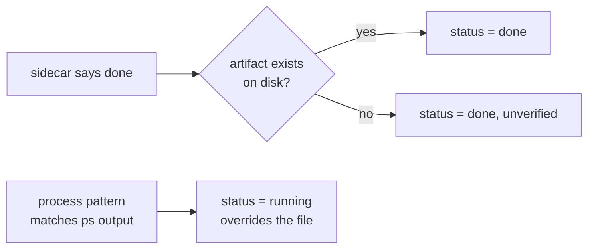

# Jobs and runs

An agent's turn is short. A batch migration, a corpus rebuild, a long test
sweep is not. The moment work needs more wall-clock time than a chat turn
gives it, something has to outlive the conversation that started it — and
that something needs to be a process the board can check on, not a claim the
board has to believe.

This document covers the part of `coordharness` that makes that split safe:
the `runs` table, the `job_progress` sidecar files a running job writes as it
goes, how the board decides whether a run is actually alive, how it
reconciles a run whose process died without telling anyone, and what it
takes for a job to be marked done.

## Why heavy work is a tracked script, not an agent loop

The tempting shortcut is to have an agent sit in a loop polling a long job:
"kick off the migration, check back every few minutes, report when it's
done." Two things break this in practice.

An agent session is not a durable process — it can be compacted, restarted,
or run out of turns before the job finishes, and if the agent *is* the thing
watching the job, nothing is watching it once the agent goes away. And an
agent reporting "still running, 40% done" is a claim, not a fact: a status
field anyone can set to `running` and never revisit is indistinguishable,
six hours later, from one describing a process that crashed in the first
minute.

The fix is to make heavy work a **script with its own process identity**,
launched once, that writes its own progress to a file as it runs, while the
board checks on every read whether that process is still there. The agent's
job is to start it, record that it started it, and move on — not to babysit
it.

## The run record

Starting a tracked job is a `runs` row:

```sql
CREATE TABLE runs (
  run_id            TEXT PRIMARY KEY,
  work_id           TEXT REFERENCES work_items(work_id),
  session_id        TEXT REFERENCES agent_sessions(session_id),
  parent_session_id TEXT,             -- fan-out: workflow spawning several runs
  runner_kind       TEXT NOT NULL,    -- claude | codex | subagent | workflow | ...
  model             TEXT,
  sidecar_path      TEXT,
  pid               INTEGER,
  pid_started_at    REAL,
  pgid              INTEGER,
  started_at        REAL NOT NULL,
  heartbeat_at      REAL,
  finished_at       REAL,
  state             TEXT NOT NULL DEFAULT 'live',
  version           INTEGER NOT NULL DEFAULT 0
);
```

A run is scoped to a work item (`work_id`), owned by an agent session
(`session_id`, with `parent_session_id` for a fan-out where a workflow spawns
several runs), and carries the operating-system facts the board needs to
check it later: `pid` and `pid_started_at` together, never `pid` alone.

`pid_started_at` matters because PIDs are reused. A check that only asks "is
this PID alive" will happily report a stranger's process as your migration
job once the OS hands the old number to something unrelated, months later.
The harness pairs the PID with the wall-clock time the process actually
started and refuses to call it a match unless both agree:

```python
# coordharness/coord/process_liveness.py
def pid_matches(pid, expected_start_time):
    if not pid_exists(pid):
        return False
    if expected_start_time is None:
        return True
    actual = pid_start_time(pid)
    return actual is not None and \
        abs(float(actual) - float(expected_start_time)) <= START_TIME_TOLERANCE_S
```

`pid_start_time` shells out to `ps -o lstart= -p <pid>` and compares against
a 2-second tolerance window. If the recorded and actual start times disagree
by more than that, it is a different process wearing the old one's PID, and
the run is not alive. A run's `state` column (`live`, `orphaned`, terminal)
is a cache of the last check, not the source of truth — the truth is always
"does the process described by `pid` + `pid_started_at` exist right now."

## The job_progress sidecar: one file per run

A long-running job does not write its progress into the shared database
directly — a batch script writing at high frequency, and possibly killed
mid-write, into the same SQLite file the board's readers are also hitting is
a recipe for lock contention and half-written state. Instead each run writes
its own small JSON file under a `job_progress/` directory, in the convention
kept by `coordharness/jobs/sidecar_snapshot.py` and `status.py`:

```json
{"job_id": "backfill-ledger-2026-03", "roadmap_id": "PAY-CDX-LEDGER-BACKFILL", "state": "running",
 "pct": 62.0, "done": 620, "total": 1000, "pid": 48213, "updated_at": 1772442600.0}
```

Two properties make this file trustworthy rather than merely convenient.
Writes are atomic — built in a temp file, `fsync`d, then `os.replace`d into
place — so a reader never sees a half-written document and a crash mid-write
leaves the previous good snapshot intact. And progress is monotonic within a
run: `pct` and `done` only increase, so a slow or out-of-order writer (a
straggler thread, a retried batch) cannot drag reported progress backwards.

`sidecar_snapshot.py` also **de-duplicates and merges** sidecars describing
the same logical job — for instance a resumed attempt that writes a new file
rather than reusing the old one — keyed by `job_id`, taking the freshest
value for each field. The board sees one entry, not two half-true ones.

## Deriving liveness from process state, not from the status field

This is the harness's central discipline for long jobs, and it shows up
identically at two layers: the sidecar (`derive_status` in
`coordharness/jobs/status.py`) and the `runs` table (`reap_dead_runs` in
`coordharness/coord/reaper.py`). Neither trusts the `state`/`status` string a
job last wrote about itself — both ask the operating system instead.

`derive_status` takes the raw `status` field as one input among several, but
a process-pattern match against the live process list overrides it outright:
if the process is actually running, the job is `running`, full stop,
regardless of what the file says. A `done` claim with no matching artifact
on disk is marked `unverified` rather than accepted. A `failed`/`killed`/
`stalled` claim is trusted as written, because a false negative there is
cheap to fix by re-running, while a false positive about success is not.



For a `runs` row, `reap_dead_runs` walks every row in state `live` and checks
`pid_matches` against the live process table: a run whose PID is gone, or
belongs to a different process per the start-time check above, is flipped to
`orphaned`. A run with no PID at all (a `workflow` runner that never
reported one) is aged out by a timeout instead, since there is nothing to
check directly.

## Reconciling a run whose process died

Processes die without cleaning up after themselves: a crash, an `OOM` kill, a
lost SSH session, a laptop going to sleep mid-job. The reaper turns that
silence into a fact the board can act on, as part of the same maintenance
sweep that also releases expired claims and re-checks blocked work for
readiness (`run_reaper` in `reaper.py`).

The sequence is mechanical: read every `live` run, test liveness by PID (or
by age, if pidless), and flip the ones that fail to `orphaned` with a
`finished_at` timestamp — inside one transaction, so a reader never sees a
run that is half-reaped. Nothing here inspects *why* the process died, only
*that* it did; diagnosing the cause is left to whoever reads the last
sidecar snapshot the dead process left behind — that snapshot is the
postmortem.

The same sweep also renews claims backed by a fleet of still-live runs (a
claim should not expire just because its owner is watching a background job
rather than actively heartbeating) and normalises work items whose "active"
intent has gone stale with no run and no claim behind it. The `runs` table
and the claim lease are two different lifetimes, reconciled against each
other on every pass rather than checked in isolation.

## `done_signal` and the artifact-custody requirement

A run finishing is not the same thing as the work being done. The board's
notion of "done" is gated on a `done_signal`: a declared artifact path (or,
for a tabular result, a `path.duckdb::table_name` reference) that has to
exist, be non-trivially sized, and pass custody checks that reject telemetry,
control markers, incomplete tables, and other non-proof shapes.

Markdown done-signals must be tracked by Git's current index; staging is
sufficient and no commit is required. If a workflow needs commit-pinned
custody, encode that stronger requirement in its acceptance/policy and record
the commit identity as evidence.

A settling window sits on top of this (`artifact_settled`, a short grace
period after the artifact's own last-modified time), so a job is not marked
done from a snapshot of a file a process is still writing to — a reader
hitting the sidecar mid-flush sees "still finishing," not a false green.

## Launching tracked local work

The branch includes the preview `coord-jobs` executable for bounded POSIX
launch and read-only status:

```bash
# First claim an existing queued row assigned to this exact actor/session.
coord claim INFRA-201 --step "launching the synthetic telemetry check"

# Copy claim_id and claim_fence exactly from the claim response.
coord-jobs launch \
  --job-id DEMO-JOB \
  --roadmap-id INFRA-201 \
  --session-id codex:demo \
  --claim-id CLAIM_ID_FROM_CLAIM \
  --claim-fence CLAIM_FENCE_FROM_CLAIM \
  --cap-gb 1 \
  -- python -c 'print("synthetic job")'

coord-jobs status
```

The launcher refuses unknown, terminal, archived, wrong-owner, expired, or
stale-fence work before invoking the child. It reserves one run row, then holds
an immediate database transaction while it revalidates that exact
`work_id`/`session_id`/`claim_id`/`claim_fence` tuple and starts the
process. A concurrent revocation cannot slip between the final authority check
and process creation. Only the reserved row is promoted; launch never creates
or rewrites a work item.

After that guard succeeds, the launcher creates a process group, records an
atomic sidecar, applies an RSS cap, and reconciles the run record. The fence is
launch authority, so do not paste it into issue reports or persistent job
telemetry. Specialized GPU/group launch primitives are also present. This is
not a cross-platform scheduler or a service supervisor: Windows job objects,
distributed queues, automatic retries, and hosted worker management remain
outside the current contract.
