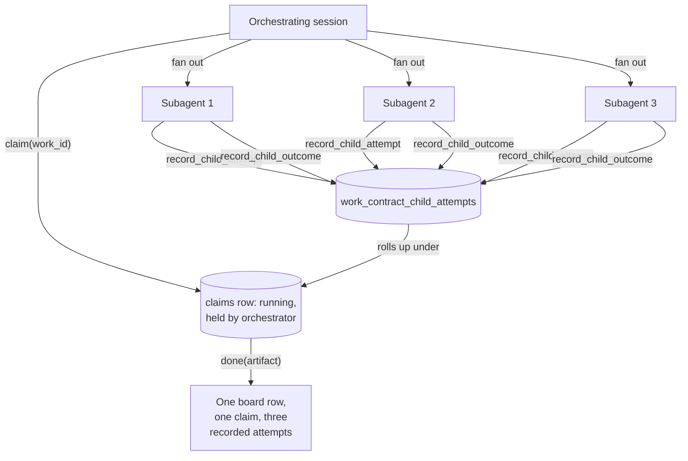
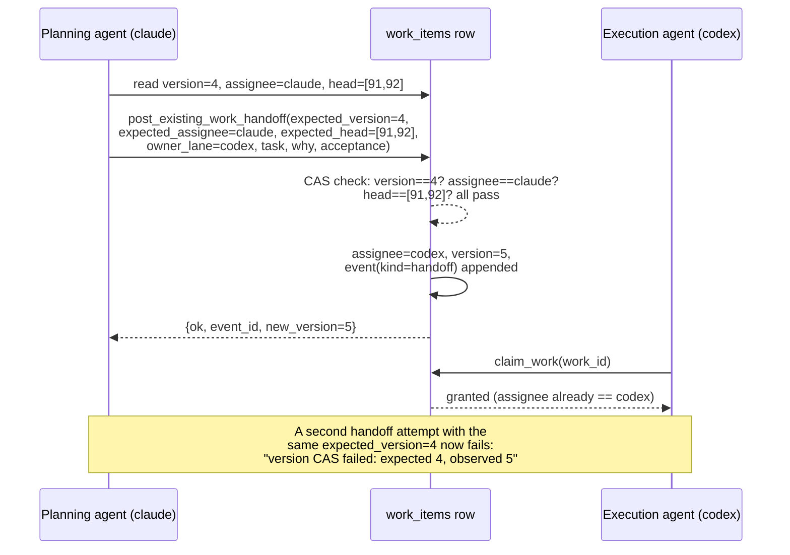
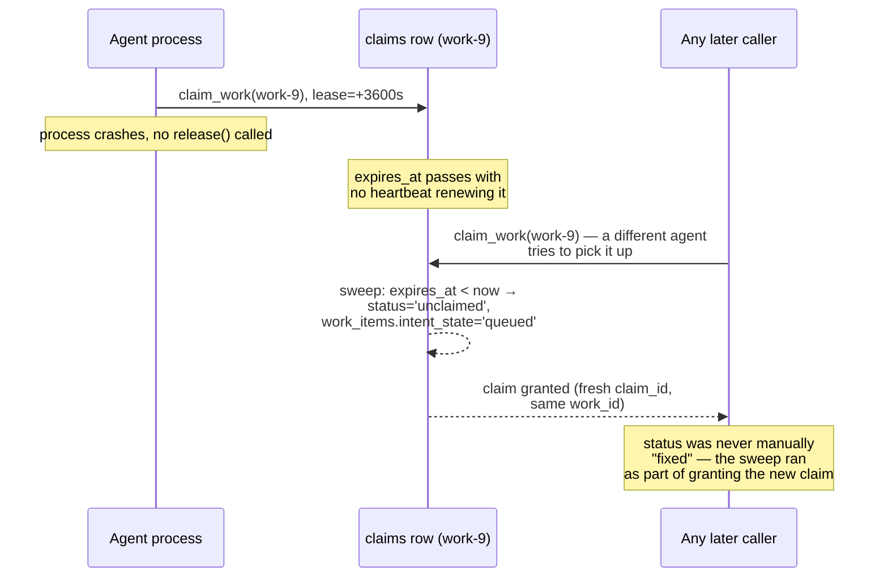

# Multi-agent patterns

`coordharness` exists because one agent working alone doesn't need a
coordination layer — it needs a to-do list. The moment a second agent, or a
second *kind* of agent, starts touching the same board, a new set of
problems shows up that a to-do list has no answer for: which agent owns
this row right now, what happens to a hundred subagents nobody told the
board about, how ownership moves from one agent to another without a race,
and who is allowed to say a review passed.

This document is about that shape specifically — fleets, not individuals.
[`coordination-model.md`](coordination-model.md) covers the lifecycle of one
job in isolation; [`agent-protocol.md`](agent-protocol.md) is the procedural
contract an individual agent follows session to session. This document sits
above both: how several agents, of different kinds, end up producing one
board that means what it says.

## Agent kinds are not interchangeable, so the schema doesn't treat them as one

`agent_sessions.runner_type` and `runs.runner_kind` both carry a small,
open vocabulary — `claude_chat`, `codex`, `local_gpu`, `local_cpu`,
`background`, `subagent`, `workflow`, `api` are the values used across the
codebase and the seeded demo. They look like a label you could ignore. They
aren't, because liveness — the question the whole harness exists to answer
truthfully — is checked differently for each one:

- A `claude_chat` or `codex` session backed by a real OS process is checked
  by PID: is a process with this `pid`, started at this `pid_started_at`,
  still alive right now? (`process_liveness.pid_matches`, see
  [`jobs-and-runs.md`](jobs-and-runs.md).)
- A `local_gpu` or `local_cpu` run is usually a script with its own process
  identity, checked the same PID way, but tracked separately from the
  session that launched it — the session might be a two-line chat prompt,
  the run might take an hour.
- A `background` or `workflow` run often has no PID to check at all — a
  workflow step, a queued job on another host — so it's aged out by a
  timeout against its last heartbeat instead of by process liveness.
- A `subagent` run has no independent lease of its own; it exists inside a
  parent's claim and is reconciled through that parent (more on this
  below), not tracked as a peer.

Collapsing all of these into one generic "agent" concept would mean picking
one liveness check and getting it wrong for the other three. A workflow
step polled by PID looks permanently dead, because it never had one. A
local GPU job polled only by heartbeat timeout looks alive for the full
timeout window after it actually crashed. The schema keeps `runner_type`
precisely so the reaper (`reap_dead_runs`, `reap_zombie_sessions`) can ask
the right question of the right kind of row instead of one wrong question
of all of them.

## One identity per agent, not one per prompt

A session ID — `claude:payments`, `codex:infra`, `local:batch` in the
seeded demo — is meant to persist for an agent's whole working stretch, not
get re-minted every time it's given a new instruction. Two structural
things break if it isn't:

- **Claims are keyed to `(work_id, session_id)`.** Resuming a paused claim
  works by checking whether the resuming session shares an identity with
  whoever originally held it. A fresh ID every prompt makes every resume
  look like a stranger asking for someone else's row, and the schema's
  partial unique index (`ix_one_held_claim`) has no way to tell "the same
  agent, back again" from "a different agent entirely."
- **The rollup view groups by session.** `v_session_rollup` and the
  `preflight` orientation call both key off `session_id` to answer "what is
  this agent already holding." An orchestrator that mints a new ID per task
  produces a board with one abandoned-looking session per prompt — real
  work, invisible because nothing groups it together.

This is covered in full, with the reasoning per failure mode, in
[`agent-protocol.md`](agent-protocol.md#one-session-identity-not-one-per-prompt).
The point that matters at the fleet level is narrower: a fleet is legible
only if every member of it — the orchestrator and every long-running run it
launches — has one stable identity apiece, not a churn of throwaway ones.

## Spawning a fleet is starting a job, because subagents can't speak for themselves

This is the sharpest edge in the whole system, and it's sharp on purpose.

A subagent — a burst of parallel work an orchestrating session fans out to
cover more ground per turn — has no session of its own that writes to the
board. It has no claim, no lease, no `agent_sessions` row unless something
explicitly gives it one. If the orchestrator hasn't claimed the parent work
item before fanning out, the entire fleet runs, does its work, and finishes
without the board moving at all. No lease exists to expire. No row shows
`running`. Nobody watching the board — another agent checking for
conflicts, an operator glancing at the dashboard — has any way to know five
agents were ever active.

`coordharness` turns this from a convention into an enforced precondition.
Recording a subagent's existence goes through `record_child_attempt`, and
it requires an already-held claim:

```python
row = _held_claim_row(conn, claim_id)   # raises UnclaimedFleetError
                                         # if claim_id is unknown or not
                                         # in a held status
```

`UnclaimedFleetError` is not a warning — it's a hard rejection, and its
message names the fix directly: record child attempts only under a claim
you already hold. There is no path in the API that lets a fleet's outcome
get written against a work item nobody claimed first.

The full shape, once the parent claim exists:

1. Claim the parent work item.
2. For each subagent, call `record_child_attempt(claim_id, child_label,
   executed_by, model=...)` — a row in `work_contract_child_attempts`
   naming which model ran which piece of work, under which claim.
3. As each subagent finishes, call `record_child_outcome(attempt_id,
   outcome, outcome_ref=...)`.
4. Close the parent claim with `done` (a real artifact) or `park`/`block`
   if the fleet didn't finish the job.

`fleet_records_missing_model` exists specifically to audit fleets that got
the claim right but skipped step 2's `model` field — a fleet claimed and
closed with no record of what actually ran inside it is only half tracked.



The payoff is the last box: three, ten, or a hundred subagents produce one
row with a recorded history underneath it, instead of zero rows (the
unclaimed-fleet failure) or a hundred indistinguishable parallel ones. The
`runs` table applies the same idea for longer-lived children: a `run`
carries `parent_session_id`, and `ix_runs_parent` answers "what's running
under this session" in one indexed query instead of a full scan.

## Handoffs move ownership between kinds, under optimistic concurrency

A planning agent hands off to an execution agent. A background batch job
finishes its mechanical part and needs a chat-driven agent to review the
result before continuing. Either way, ownership of a work item needs to
move from one agent's lane to another's, visibly, without a window where
two agents both believe they own the row.

Two guards make this safe:

**You cannot just claim someone else's work.** `claim_work` checks the
work item's current `assignee`; if it's held by a different actor, the
claim is rejected with an error naming the handoff path. There's no code
path where one agent decides to start typing into a row assigned to
another agent and the board simply allows it.

**A handoff is a compare-and-swap, not a message.** The typed handoff
operation (`post_existing_work_handoff`) requires the caller to state, up
front, the exact state it believes the row is in: `expected_version` (the
row's optimistic-concurrency counter), `expected_assignee` (must equal the
caller — you can only hand off work you actually hold), and
`expected_head_event_ids` (the specific event IDs the caller believes are
the current "head" of the row's assignment history). All three are checked
against the live row inside one transaction, and if any of them has moved
— someone else advanced the row after the caller last read it — the whole
handoff is rejected with a message naming exactly which check failed
(`version CAS failed`, `assignment-head CAS failed`), rather than silently
overwriting whatever the other party did. A retried handoff carries an
`operation_id` and replays its original result instead of applying twice.



A typed handoff moves work between *lanes*, and requires `owner_lane` to
differ from the caller — a handoff always crosses an actor boundary. A
handoff also requires at least one ref and one explicit constraint; an
empty "here, take it" is rejected outright.

### Configuring the lanes: `COORD_LANES`

The lane vocabulary is configuration, not a fixed pair. `COORD_LANES` is a
comma-separated list of lane names; tokens are trimmed and lowercased,
duplicates collapse, and each must satisfy the same public-identifier
grammar as `COORD_ACTOR` (start with a letter; lowercase letters, digits,
dot, underscore or hyphen; 64 characters at most). Unset, it means
`claude,codex` — the pair this harness shipped with, so an existing
deployment sees no change. Set to an empty or whitespace-only value it is a
configuration error rather than a silent fallback, because an empty lane set
would refuse every actor.

```bash
export COORD_LANES=claude,codex,gemini
export COORD_ACTOR=gemini
export COORD_SESSION_ID=gemini:review-1
coord claim DEMO-CDX-EXAMPLE --step "reading the derivation"
```

A lane named here is a first-class lane: it registers a session, claims
rows, receives a typed handoff as `--owner-lane`, and appears in the
`choices` of every lane-valued CLI flag (the parser reads the configured set
when it is built, so `coord handoff --help` shows exactly the lanes this
deployment recognises). An actor that is *not* in the set is refused by the
lane-exact verbs, and the refusal names the configured lanes rather than a
hardcoded pair.

Two invariants are independent of how many lanes are configured, and stay
enforced:

* **`owner_lane` must differ from the actor.** A lane cannot hand work to
  itself. Where a verb needs a default cross-lane address — an unaddressed
  note, a verdict with no `--to-lane`, an audit request — it resolves to the
  first configured lane that is not the actor's own. With the default pair
  that is exactly "the other one"; with three or more it is deterministic
  and still never the actor.
* **A same-lane verdict never counts.** The lane that authored a row cannot
  PASS it, and the author lane is derived from the row's claim history
  rather than from a caller-supplied label. Independent review is defined as
  a verdict whose actor is a configured lane *other than the author's* —
  inequality with the author, never membership in one privileged pair — so a
  configured lane's verdict clears another lane's row on the same terms the
  original two had, and a same-lane verdict that does land (a `FLAG`, say)
  still leaves the row unreviewed.

The per-lane machinery follows the configured set with the lane: the
lifecycle event kinds (`gemini_claim`, `gemini_done`, `gemini_block`, …), the
`actor:<lane>` selectors that address a lane, and the request-consumption
backfill that reads them are all derived from `COORD_LANES` rather than
enumerated. A verb that needs a cross-lane address and finds no second lane
configured refuses and says so, rather than quietly addressing the caller.

Adding a lane is a deployment decision with a governance consequence: the
lanes are who may review whom. Name only agents you would accept as
independent eyes on the others' work.

## Avoiding collisions on the same files

The board coordinates rows by default, not files — two claimed rows can
touch the same path unless an agent says so explicitly. Where that risk is
real, a claim can declare a write set: path-prefix scopes it intends to
touch. Any agent can then ask whether the *currently held* claims overlap,
and get back the specific rows and the specific colliding paths, not just a
yes/no. Full detail is in
[`agent-protocol.md`](agent-protocol.md#avoiding-file-collisions-between-two-agents);
the fleet-relevant point is narrower: a write set is a property of the
*claim*, so it composes with everything above it. A subagent fanned out
under a parent claim inherits the parent's declared scope rather than
needing its own, and two independently orchestrated fleets working the
same module will only collide visibly — as a named,
checkable overlap — if both bothered to declare what they were touching.
Declare scopes when two agents might actually share ground; skip it for
work that's genuinely partitioned, where the ceremony buys nothing.

## What happens when an agent dies mid-task

Every mechanism above assumes agents behave. Real fleets don't always: a
laptop sleeps, a container gets OOM-killed, a network partition drops a
background worker mid-run. Nothing here waits for someone to notice.

Liveness is never a stored boolean — it's a lease compared against the
current time, re-derived on every read and re-checked on every write.
Three layers of the same idea:

- **A claim's lease** (`claims.expires_at`) is swept before it's granted,
  refreshed, or read for status. An expired claim in `running`, `paused`,
  or `blocked` is flipped to `unclaimed`, and — in the same transaction —
  the work item's `intent_state` resets to `queued` (unless it was
  deliberately parked or blocked, which sticks).
- **A run's process** (`runs.pid` + `pid_started_at`) is checked against
  the live process table by `reap_dead_runs`; a run whose PID is gone, or
  now belongs to a different process per the start-time comparison, is
  flipped to `orphaned`. A pidless run (a `workflow` or `background` runner
  that never reported one) ages out on a timeout instead.
- **A whole session** (`agent_sessions`) is reaped by
  `reap_zombie_sessions` once its process is confirmed dead or an operator
  names it: every claim it held is released, every live run it owns is
  marked `orphaned`, and the session itself moves to `reaped`.

None of these three checks are a background daemon someone has to remember
to run — they fire inline, inside the same transaction, the next time
anything touches the affected row. A row that's been dead for an hour with
nobody watching repairs itself the moment the *next* reader or writer looks
at it, not on a schedule.



The dead agent never gets a callback telling it the claim expired, and
nothing needs to. The correction happens as a side effect of the *next*
legitimate access — the fleet self-heals by construction, at the cost of
the row sitting stale for however long nothing else needed to touch it.

## Review separation: the author cannot clear their own work

A fleet where every agent can also review its own output is a fleet that
can mark anything done regardless of quality — the review layer only means
something if the reviewer and the author are structurally different
parties, not just different calls in the same session.

Verdicts are events, not a status flag: a `PASS`, `FLAG`, or `BLOCKED`
verdict is an `audit_verdict` event attached to a specific work row, and
whether a row counts as reviewed is *computed* at read time by
`classify_verdict_status()`, never stored as a boolean anyone could flip
directly. That function's first and most load-bearing check is
`self_verdict`: if the most recent verdict on a row was written by the same
lane that authored the work, the row is **not** reviewed, full stop — the
verdict exists, it just doesn't count. A second failure mode matters
specifically at fleet scale: `cross_row_verdict`, where a verdict was
recorded on some *other* row that merely mentions this one in its refs or
body. That's the shape a hurried fleet produces by accident — one
subagent's review getting pointed at as if it covered a sibling's output —
and it's rejected the same way a same-author verdict is.

The required reviewer, when review is required at all, is always the
*other* lane from whoever authored the row (`review_ready_t0_queue()` — see
[`review-tiers.md`](review-tiers.md) for the full tiering model). At fleet
scale this has a direct consequence: an orchestrator that both spawns the
subagents doing the work *and* the subagent grading it has not produced
independent review, no matter how the two calls are labeled — the schema's
notion of independence is lane-level (which actor authored the claim), not
call-level (which prompt happened to issue the verdict). Getting a real
second opinion means routing the review through a different lane's claim,
not a different function call inside the same one.

## What this doesn't cover

This document is the shape of coordinating several agents, not the
mechanics of any one lifecycle verb — see
[`coordination-model.md`](coordination-model.md) for what `claim`,
`heartbeat`, and `done` do to a row, [`jobs-and-runs.md`](jobs-and-runs.md)
for how a long-running script's progress is tracked apart from a chat
session's claim, and [`mcp-server.md`](mcp-server.md) for the tool surface
most of this is called through in practice. What's here is the layer above
all of them: why a board built for one agent has to change shape — in its
schema, not just its process — the moment a second kind of agent shows up
on it.
