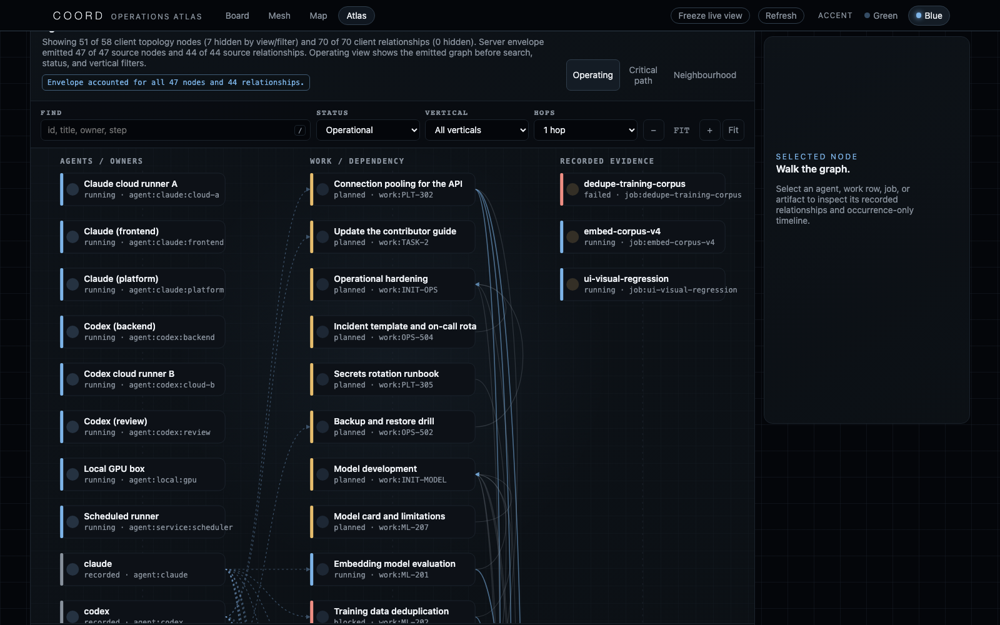

# Operations Atlas

Operations Atlas is the high-density, read-only view of a COORD fleet. It is
designed to answer four operator questions without turning a projection into a
second control plane:

- What work is moving, waiting, or structurally unsafe?
- Which recorded acyclic prerequisite has the greatest downstream reach, and
  which cycles must resolve as components before scheduling can be derived?
- Who holds the visible work, and where did execution evidence land?
- Is the graph complete enough to trust, or did a cap, collision, unknown, or
  missing endpoint change what is on screen?

Start the local board and open `http://127.0.0.1:7870/ops`.

<p align="center">
  
</p>

<p align="center"><sub>The rail says which documents make this screen and the
generation that binds them. The metrics are recorded counts or named graph
derivations, never productivity scores.</sub></p>

## From visual inspiration to an auditable instrument

The design borrows useful interface patterns without borrowing unsupported
claims. A dense autonomous-team console becomes a typed topology and occurrence
ledger, not a theatrical swarm. A context graph becomes bounded neighbourhoods,
typed edges, dead-end accounting, and explicit omissions, not a hairball that
looks complete. A memory dashboard becomes a visible separation between live
coordination, source-bound context, derived retrieval, and accepted recall, not
one ambiguous pool called memory.

| Visual pattern | Operations Atlas translation | Deliberate refusal |
|---|---|---|
| Moving agents and event trails | Finite occurrence receipts on recorded actor-to-work edges | No ambient particles or simulated activity |
| Large context mesh | Deterministic operating, critical-path, and bounded-neighbourhood modes | No force layout whose distance appears meaningful |
| Pipeline and traversal telemetry | Typed document rail, envelope counts, dead ends, collisions, caps, and unknowns | No hidden pruning or unexplained completeness |
| Chief-of-staff control room | Read-only fleet state, attention signals, evidence, and structured questions | No implied dispatch authority or unrecorded assignment |
| Cost, exposure, or capability panels | Omitted until those facts have accepted schemas and safe publication contracts | No invented spend, permissions, risk, or agent skill scores |

## One authority, one coherent read

```text
coord.db + tracked job projections
                |
        one byte-stable copy
                |
     +----------+----------+----------+
     |          |          |          |
 snapshot     graph      context   timeline
     +----------+----------+----------+
                |
       OpsAtlasV1 + GraphEnvelopeV1
                |
   operations + refresh health -> /ops (read only)
```

The server builds every document from the same frozen database bytes, derives
the operational document from those already-public projections, and swaps the
whole set under one lock. Operations Atlas does not open SQLite independently.
If any builder fails, the server keeps the last coherent set rather than
publishing a half-old, half-new view.

`ReadStatusV1` reports cache generation, last attempt, last success,
consecutive failures, and only the failure's class name. It carries no
exception message or source path. A rebuild failure therefore becomes visible
without widening the publication surface.

Temporal integrity is part of that health contract. Atlas compares event
timestamps with the same fixed read clock used to build the coherent bundle.
Any event beyond the allowed one-second clock tolerance makes the read
**DEGRADED**, publishes the affected row identities, excludes those events from
the 24-hour activity count, and names the contradiction in the intervention
ledger. A future-dated occurrence can therefore never make a quiet fleet look
live.

`coord.db` remains lifecycle authority. The browser cannot claim, release,
complete, approve, edit, or dispatch work.

## Reading the surface

| Region | Question answered | What the marks mean |
|---|---|---|
| Read-model rail | Did every expected document arrive from one instant? | Each stage names its schema and generation time. A failed browser fetch is shown as degraded, not mistaken for a quiet board. |
| Operational summary | How large and active is the visible fleet? | Counts are recorded rows, sessions, graph elements, event occurrences, dependency-ready work, and derived path width. They are not productivity or quality scores. |
| Live topology | Who holds what, what waits on what, and where is proof attached? | Columns encode node kind. Node state controls the accent. The deterministic vertical order is grouping only—not duration, priority, importance, or chronology. |
| Selected-node inspector | Why is this node here? | The inspector lists only published row fields, direct typed relationships, and occurrence-only events. |
| Activity ledger | What was recorded recently? | Time, event kind, actor, and row identity. Event prose and payloads are never present. |
| Intervention ledger | Which structural conditions deserve inspection? | Missing targets, cycles, lease risk, incomplete proof, stale projections, absent resume conditions, and future-dated events, each with a measured count. |
| Downstream reach | Which dependency-safe prerequisites have the greatest recorded downstream reach? | Reach is graph traversal count, not an immediate-unlock claim, predicted business value, or estimated time saved. Cycle members are reported once as a component and never ranked individually. |
| Fleet shape | How is visible work distributed by owner lane? | Counts by the published owner prefix. An owner lane is not proof of a live process. |

## Topology semantics

The stored dependency edge is `consumer -> prerequisite`: row A records that it
depends on row B. The rendered arrow is reversed to read as execution flow,
`prerequisite -> consumer`, so the visual answer to “what does this unlock?” is
direct rather than backwards. The edge ledger and inspector retain the stored
relationship type.

Other edges keep their own meaning:

| Edge | Meaning | Visual treatment |
|---|---|---|
| `depends_on` | A row names a prerequisite | prerequisite to consumer, accent line |
| `parent` | A row names structural containment | subdued structural line; never treated as a blocker |
| `evidence` | A declared artifact supports a work row | work to artifact |
| `runtime_evidence` | A tracked job names the work row it supports | work to job receipt |
| owner hold | Browser-derived link from a published owner lane to its rows | dashed link; a grouping aid, not a database edge |

The default Operating view separates owner, work, and evidence columns. Critical
path isolates one deterministic longest prerequisite chain. Neighbourhood shows
only the selected node and its bounded 1- or 2-hop surroundings. Every partial
view states the full and displayed node counts.

Dependency cycles fail closed. The server condenses strongly connected
components, propagates cycle taint to every downstream component, and withholds
those rows from critical-path, schedulable-layer, and individual leverage
metrics. A cycle is shown once with its members and component-level downstream
reach. That reach becomes meaningful only if the whole component resolves; it
does not promise that every downstream row immediately unlocks. Disconnected
acyclic work remains measurable and is explicitly labeled as an acyclic subset.

Dependency analysis is also independently bounded to a deterministic maximum
of 400 work rows, even if a caller asks for a larger graph envelope. The
projection publishes the total, emitted, and omitted analysis populations, so a
400-row calculation can never look like an unqualified answer over a 1,200-row
board. Work outside that population remains outside—not silently absent.

Prerequisite uncertainty has two distinct receipts:

- an **analysis-boundary edge** points to work that exists on the board but is
  outside the emitted dependency population;
- a **missing-prerequisite edge** points to an identity absent from the board.

The source row and every downstream row are tainted by either condition and are
withheld from critical path, schedulable layer, individual downstream reach,
and dependency-clear counts. The Atlas publishes exact total and emitted edge
counts, each reason's affected-row memberships, and a de-duplicated union of
unique withheld rows. A row tainted by both reasons is counted once in that
union. Bounded identity lists never imply that omitted identities do not exist.
The UI labels these as a dependency-safe subset, separately from cycle-limited
and population-bounded states.

<p align="center">
  
</p>

<p align="center"><sub>Columns carry node kind. Vertical position is deterministic
grouping only; it is not time, priority, importance, or duration. The server
envelope and the client filter receipt both state what is hidden.</sub></p>

## Ask the graph—bounded questions

The four question buttons are structured traversals, not an unrestricted agent
prompt:

- **Greatest downstream reach?** ranks only untainted acyclic work by reachable
  dependents. Unresolved cycle components receive a separate component receipt;
  no member receives an individual unlock rank.
- **What needs attention?** filters to recorded attention states and integrity
  signals.
- **Which claims are at risk?** focuses rows with an expired or near-expiry
  published lease.
- **What just changed?** selects the rows named by the most recent occurrence
  records.

Each answer is reproducible from the current documents. The surface does not
invent estimates, costs, permissions, agent skills, or causal conclusions.

## GraphEnvelopeV1: a graph must disclose its absences

A clean graph can still be misleading if the renderer silently drops data.
`GraphEnvelopeV1` wraps the emitted graph with the accounting needed to judge
its scope:

- raw population, eligible population, emitted population, and emitted bytes;
- omissions by reason, including missing identities and endpoints, duplicate
  quarantine, node or edge caps, and byte-cap fallout;
- duplicate node and edge identities, with a bounded list of affected IDs;
- unknown node kinds, edge kinds, and relationship states;
- deterministic caps and a source-content SHA-256;
- an explicit `complete` flag that is true only when nothing was omitted.

Duplicate identities are quarantined rather than merged. Unknown values remain
visible and are reported rather than being coerced into a familiar category.
The source hash identifies the exact source document; it is not a trust verdict
or a cryptographic signature.

## Failure and refresh behavior

The server-side cache is atomic: a failed rebuild replaces none of the served
documents. The browser normally reads one `OpsAtlasBundleV1` response captured
under the same lock as its `cache_generation` receipt. It never assembles a
new screen from documents served across different cache generations. A legacy
server without the bundle route can still be inspected, but the fallback is
named as degraded compatibility behavior rather than presented as an atomic
read. A stopped server must never look like an uneventful fleet.

The screenshot capture gate is equally strict: it refuses to photograph Atlas
unless the clock is LIVE, the contradiction alert is absent, and the coherent
bundle reports zero future events. On compact screens the read rail and metric
strip stay complete inside clearly labelled horizontal scroll regions; the
topology still begins in the first viewport instead of being silently pushed
below a wall of summary cards.

**Freeze live view** freezes the browser's displayed copy: automatic refresh
stops and manual refresh is disabled until the operator resumes. It does not
pause agents, jobs, claims, or the server cache.

## Motion that only says true things

Motion is an evidence channel, not ambient decoration:

- A newly observed event occurrence may travel from an actor/owner node to the
  work node only when the published actor identity matches a recorded
  owner-holds-work relationship. A mismatched actor is reported as a stationary
  occurrence receipt; it is never reassigned to the recorded owner for visual
  convenience.
- A finite node pulse means one or more named published tuple fields changed
  between coherent refreshes. The visible and accessible description names
  those fields and explicitly does not call the change progress.
- A critical-path or question walk traces a deterministic recorded traversal.
  Its direction and bounded sequence explain the graph; they do not predict
  duration or simulate agent activity.
- Initial load produces no change animation. Receipt motion, pulses, and edge
  walks are capped and self-remove. Freeze and `prefers-reduced-motion` suppress
  them all without removing the equivalent text and ledger evidence.

## Security and privacy boundary

Operations Atlas inherits the board boundary:

- loopback by default;
- same-origin, no-inline-content Content Security Policy;
- an explicit static-file allowlist;
- `GET`, `HEAD`, and `OPTIONS` only; mutating methods return `405`;
- no event body, payload, decision text, knowledge text, command source,
  credential, API key, permission inventory, or capability inventory;
- no authentication, authorization, TLS, tenant isolation, or safe public-host
  mode.

The last point matters: read-only is not the same as internet-safe. Keep the
board on a trusted local machine unless a separate authenticated boundary is
designed and reviewed.

## Interaction and accessibility

- Press `/` to focus search and `Escape` to clear the active interaction.
- Use Tab to reach graph nodes; Enter or Space selects one.
- Filters, graph questions, inspector relationships, and ledger rows are all
  available without pointer input.
- The topology has a flat inspector/ledger equivalent for precise reading.
- The selected node is preserved across successful refreshes when it still
  exists.
- The canonical `#sel=<row-id>` capsule accepts a Board deep link and updates
  when Atlas selection changes. A filtered admitted node is revealed in a
  bounded neighborhood; an omitted or unknown id produces a graph-envelope
  receipt and is never presented as absent from `coord.db`.
- Reduced-motion preference disables receipt travel, recent-node pulses, and
  path walks. No meaning depends on animation alone.
- Color always accompanies text, shape, state labels, or ledger counts.

## Capability boundary

| Capability | Status | Boundary |
|---|---|---|
| Coherent snapshot, graph, context, and timeline read | Implemented | One stable copy, atomic cache swap, and one-generation browser bundle |
| Rebuild health and last-good-cache state | Implemented | `ReadStatusV1`; failure class only, no exception prose |
| Bounded operational analytics | Implemented | Pure derivation from the four public documents |
| Deterministic topology, critical path, impact, and neighbourhood | Implemented | Descriptive graph traversal; 400-row analysis cap; cycle, boundary, and missing-prerequisite taint fail closed with total/emitted receipts; no immediate-unlock or duration forecast |
| Omission, unknown, collision, and cap accounting | Implemented | `GraphEnvelopeV1` |
| Read-only inspection and structured graph questions | Implemented | Browser-local interaction only |
| Lifecycle action buttons or autonomous dispatch | Intentionally absent | `coord.db` writers remain separate authenticated tools |
| Cost, spend, tokens, access rights, or agent capabilities | Intentionally absent | The standalone board does not publish those facts |
| Hosted multi-user operations service | Intentionally absent | No authentication, tenancy, or TLS |
| Duration-aware scheduling and bottleneck prediction | Future, schema-dependent | Requires measured duration history and an accepted contract |
| Versioned operational memory/rule editor | Future, writer-dependent | Requires a separate authorized mutation protocol |

## Verification

The implementation is covered at three layers:

1. pure analytics tests for critical paths, impact, SCC cycle taint, downstream
   withholding, a 1,200-row adversarial chain, boundary and missing-prerequisite
   taint, dependency-clear safety, lease risk, bounded activity, and prose-field
   re-selection;
2. adversarial envelope tests for collisions, unknowns, missing endpoints,
   caps, determinism, and byte limits;
3. route, read-only, atomic-refresh, bundle-coherence, palette, keyboard,
   actor-mismatch, finite-motion, reduced-motion, population-only and
   unresolved-only receipts, future-event temporal refusal, above-fold
   topology, console, and responsive browser checks against the fictional demo
   board.

The demo is synthetic evidence for the renderer. It does not establish public
release rights or prove behavior against every real coordination database.

For why this is a neutral clean-room surface rather than a port of a private
operations product, see [operations graph assessment](operations-graph-assessment.md).
