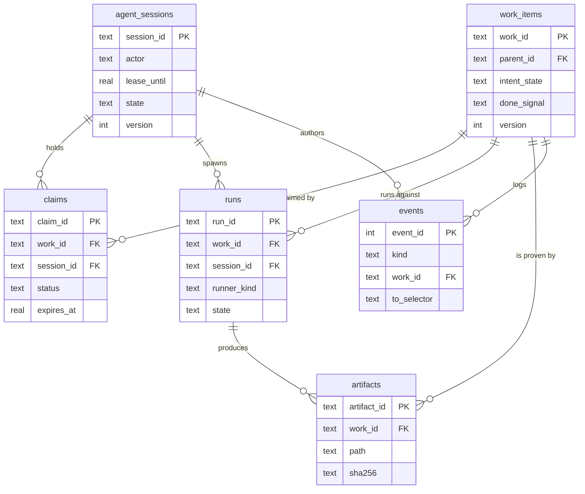

# Data model

This is the reference for `coord.db`, the SQLite database behind every
`coordharness` command. Start with the five-table core diagram, then use the
per-table sections for the columns that matter and the invariant each one
protects.

The schema ships as one file, `src/coordharness/coord/schema.sql`, applied
idempotently by `create_schema.py`: every statement is `IF NOT EXISTS`, so
running it against an already-current database is a no-op. Two migrations
layer on top; see [Migrations](#migrations) for what they add.

## Design decisions worth stealing

**Status is a view, not a column.** No table stores `"running"` as a fact.
`work_items.intent_state` records what an agent last declared and
`claims.status` records whether a lease is held, but whether that lease is
still *live* depends on the wall clock, which cannot be stored correctly —
it drifts the instant you write it. Views join the structural facts; the
caller supplies "now" as a bind parameter at query time, so a dashboard
open for an hour still reports accurate liveness on every refresh.

**Every mutable table carries a `version` column for optimistic
concurrency.** Two agents racing to update the same row is the normal case
here. Rather than take a lock, each table stamps a `version` integer the
writer increments; a write against a stale version fails instead of
silently clobbering a concurrent update.

**Grouping is nullable attributes, not a foreign-key hierarchy.**
`work_items` has `domain`, `module`, `lane`, `sublane` — none `NOT NULL`,
none referencing a lookup table, none nested by constraint. A rigid
category-then-project-then-task chain forces every reorganisation into a
migration, and the taxonomy work gets grouped by changes far more often
than the work itself does. Flat, relabel-able tags give the same filtering
power for free: switching the board's default grouping from `module` to
`lane` needs no migration, just a different query.

**One held claim per work item, enforced by a partial unique index.** The
promise that two agents cannot work the same item is not application
logic that might have a bug — it is `ix_one_held_claim`, a `UNIQUE INDEX`
on `claims(work_id)` filtered `WHERE status IN ('running', 'paused',
'blocked')`. SQLite rejects a second insert at the database layer,
atomically, under concurrent writers. Paused and blocked claims still hold
the slot on purpose — suspended work is not abandoned work — and only
`released`, `completed`, or `unclaimed` free the index. This is the guard
`tests/test_lifecycle_smoke.py` checks as "cannot claim work assigned to
someone else."

## Core six tables

A work item is defined in `work_items`, a session in `agent_sessions` takes
a `claims` row against it, that session may spawn `runs` (a background job,
a subagent fan-out), and everything along the way is appended to `events`.
A finished item points at an `artifacts` row as proof.

### `agent_sessions`

One row per live agent session — a chat, a background worker, a subagent —
the identity the rest of the schema hangs work off, existing specifically
to stop two concurrent processes for one logical agent from clobbering
shared state.

- `session_id` (PK) — supplied by the environment or minted once and reused
  for the process's life.
- `actor` / `actor_id`, `parent_session_id` — who this is, and (for a
  subagent) the parent it rolls up under instead of appearing as a peer.
- `runner_type` — interactive chat, subagent, workflow step, background
  process, local CPU or GPU job.
- `pid` / `pid_started_at` — the OS process backing this session plus its
  start time, together catching PID reuse: a process now holding that PID
  but started at a different time didn't take this lease.
- `lease_until` — live iff the caller's current time is before this value;
  nothing stores "is this session alive" as a boolean.
- `pause_at` — deliberately paused and exempt from reaping, distinguishing
  "stepped away" from "died mid-task".
- `state` — the session's own lifecycle word (`active`, `ended`,
  `superseded`, `reaped`) — *why* it stopped, which `lease_until` can't say.

Invariant: exactly one row per live session, keyed so a reconnect resolves
to the same row instead of minting a duplicate.

### `work_items`

The unit of work — an epic, a job, or a task, per `surface` — a durable
description of something needing doing, separate from any agent's attempt
at it.

- `work_id` (PK), `parent_id` — self-referencing hierarchy.
- `domain`, `module`, `lane`, `sublane` — the nullable multi-axis grouping
  above.
- `intent_state` — declared intent (`planned`, `queued`, `running`,
  `blocked`, `done`, `failed`, `archived`). The *displayed* status comes
  from joining this against live claim/run state in `v_work_owner`.
- `done_signal` — a path to an artifact. An item resolves to done when this
  path exists and is readable, not when an agent asserts it finished. This
  is the mechanism behind "cannot complete without declared proof":
  a claim of success with nothing at this path is provably wrong.
- `acceptance_json` — a rubric checked before treating `done_signal`'s
  existence as sufficient; existence proves something was produced, the
  rubric checks it is the right thing.
- `next_step` / `resume_when` / `resume_predicate_json` /
  `continuation_ready_at` — durable state for paused-not-abandoned work: a
  human-readable condition and optionally a machine-checkable predicate for
  when it becomes actionable again.
- `resource_class` / `token_budget` — optional hard ceilings a runaway job
  can be checked against, independent of the agent's own belief about its
  budget.
- `version` — optimistic concurrency.

Invariant: `work_id` is stable for the item's life; claims, runs,
artifacts, and events all reference it rather than duplicating its
description.

### `claims`

A `(work_id, session_id)` pairing with a lease — a session's current
attempt at an item. Kept separate from `work_items` because an item can be
claimed, released, and reclaimed many times, and each attempt is worth a
record rather than an overwrite.

- `claim_id` (PK), `work_id`, `session_id`.
- `lease_token` — an opaque token proving the caller holds this claim,
  rather than trusting a self-reported session id.
- `status` — `running`, `paused`, `blocked`, `released`, `completed`,
  `unclaimed`. The first three hold the slot; the last three free it.
- `acquired_at`, `heartbeat_at`, `expires_at` — lease start, last renewal,
  and lapse time; an expired, un-renewed claim is what the reaper looks for.
- `release_reason` — finished, reaped, released, superseded by a handoff.

Invariant: at most one row per `work_id` in a held status
(`ix_one_held_claim`). The reaper flips a lapsed claim to `unclaimed` and
resets the item's `intent_state` in the same transaction, so a crashed
agent never leaves an item stuck looking claimed with nobody working it.

### `runs`

A run is execution larger than a single claim heartbeat: a background job,
a workflow, a subagent fan-out, a local model call. A claim says "this
session owns this item"; a run says "this process is doing something, and
here is how to check on it." One claim can have several runs over its life.

- `run_id` (PK), `work_id`, `session_id`; `parent_session_id` — a
  reconciliation key rolling fan-out children up without an extra join.
- `runner_kind` — `claude`, `codex`, `subagent`, `workflow`, `background`,
  `local_cpu`, `local_gpu`, `api` — determines how liveness is checked (a
  PID locally, a heartbeat timestamp remotely).
- `model` — a per-run override, so one item's planning step can use a
  larger model than its execution step rather than one model fixed for the
  whole session.
- `progress_mode` — `count`, `indeterminate`, `unit_sum`, `weighted_tasks`,
  `milestone`: what kind of number the run's progress is.
- `sidecar_path` — a realpath string to a progress file; like
  `artifacts.path`, the database never opens it.
- `pid` / `pid_started_at` / `pgid` — the same PID-plus-start-time pattern
  as sessions, plus a process group for jobs whose children reap together.
- `state` — `live` or terminal; the run's own execution state, not an
  operator-facing string (`v_runs_read_model` is for display).

Invariant: a run belongs only to the work item and session that created
it — a child record, never reassigned across owners.

### `events`

An append-only log doing three jobs: audit trail, blackboard, and mailbox.
Keeping these as one table is deliberate — a separate audit table and
message queue invite drift about what actually happened; debugging a stuck
item wants one ordered stream, not three.

- `event_id` (PK, autoincrement) — the monotonic total order everything
  else is built on, stronger than a `ts` column two concurrent writers
  could stamp identically.
- `kind` — `claim`, `heartbeat`, `handoff`, `idea`, `audit_request`,
  `audit_verdict`, `block`, `done`, `failed`, `artifact`, `decision`,
  `spawned`, `drift`, `note`, `milestone`, `job_event`.
- `actor`, `session_id` — stamped by the library, not trusted caller input.
- `to_selector` — mailbox routing: `actor:codex`, `actor:claude`,
  `session:<id>`, or `NULL` for broadcast; an inbox query is `WHERE
  to_selector IN (...) AND event_id > :cursor`, served by `ix_events_inbox`.
- `work_id`, `run_id`, `thread_id` — optional linkage to what the event
  concerns.
- `trust` — `agent`, `external`, `system`, a prompt-injection trust tier.
  Content originating outside the agent's own reasoning (a web page, a tool
  result) is tagged `external` so a reader can decline to treat it as an
  instruction.
- `body` — capped near 2KB; larger content goes by pointer in `refs_json`,
  keeping the log cheap to scan after months of history.
- `idempotency_key` — unique when present, so a retried write can't
  double-post the same event.

Invariant: rows are never updated or deleted; the log is the history.

### `artifacts`

A pointer to something produced by a run or item — the file a
`done_signal` checks for, or any output worth recording provenance for.
The load-bearing decision: `path` is a string the database never opens,
stats, or reads. Nothing in `coord.db` touches the filesystem — that is the
boundary between the lightweight coordination database and whatever large
store the artifacts actually live in, so coordination logic can reference
arbitrarily large external data by path without becoming coupled to
reading it.

- `artifact_id` (PK), `work_id`, `run_id` — what this is for and which run
  produced it.
- `path`, `kind`, `sha256` — the pointer, a free-text kind tag, an optional
  content hash.
- `validation_json` — structured validation results stored alongside the
  artifact rather than recomputed on every read.

Invariant: `path` is opaque data to this table; interpreting what is there
happens elsewhere.

### Supporting tables

- **`display_titles`** — `key` (a work id, job id, name, or
  `_name_contains:<fragment>` wildcard) to an operator-facing short title,
  keeping human labelling out of `work_items.title` so a display override
  can change without touching the record it labels.
- **`inbox_cursors`** — `(recipient, session_id) -> last_seen_event_id`,
  how a reader tracks how far it has read the mailbox without mutating the
  log; keyed per session so one session's reads don't mark events read for
  another.
- **`request_consumption`** — `(recipient_lane, work_id, request_event_id)
  -> consumed?`, so a request to an execution lane survives past the
  short-lived chat that made it.
- **`schema_migrations`** — `version`, `name`, `applied_at`, `checksum`;
  standard migration bookkeeping.

## Views

Every view here is a structural join only — none compute liveness. Where
"is this still live" matters, the caller supplies the current time as a
query parameter against a stored timestamp outside the view. Baking
`now()` into a view would make its answer depend on when SQLite happens to
evaluate it relative to when the caller reads the result — the implicit
time dependency this design avoids.

- **`v_session_claimcount`** — one row per active session with a count of
  its currently-`running` claims, without a per-session query.
- **`v_work_owner`** — every work item left-joined to its current held
  claim (if any), that claim's session, a count of live runs against it,
  and whether it has a real artifact (excluding `context_pack`, working
  notes rather than a deliverable). This is the board's read: who owns
  this item and is there evidence it produced something, in one query.
- **`v_session_rollup`** — one row per top-level session
  (`parent_session_id IS NULL`) with counts of child sessions and runs, so
  a ten-way subagent fan-out doesn't appear as ten peer rows.
- **`v_runs_read_model`** — a joined read model for a run: its columns plus
  its work item's title/display/intent state, its session's actor, and a
  computed `duration_s` (only once `finished_at` is set, clamped
  non-negative) — the one view meant for direct display of background and
  local jobs.

## Migrations

Two migrations ship in `src/coordharness/coord/migrations/`, each adding
structure beyond the core schema above.

`002_exact_authority.sql` adds a small append-only ledger
(`coord_authority_policy`, `coord_authority_generations`,
`coord_authority_versions`, `coord_authority_heads`,
`coord_authority_receipts`) for versioned classification decisions about
work items, plus a monotonic change counter (`coord_source_state`) that
every write on the core tables advances via trigger. Versions and
generations are immutable once written — corrections are new versions,
never edits — with head pointers tracking the current version per item.

`003_provenance_causal_trace.sql` adds an append-only import and lineage
ledger (`coord_provenance_batches`, `coord_artifact_object_versions`,
`coord_artifact_object_heads`, `coord_artifact_import_rows`,
`coord_provenance_quarantine`, `coord_causal_nodes`, `coord_causal_edges`,
`coord_wake_tokens`, `coord_provenance_receipts`) for tracking which
artifact objects and causal relationships (session produced span produced
run produced artifact) are verified against source evidence, versus
relationships that are plausible but unverified and get quarantined rather
than asserted as fact.

Both follow the core schema's pattern — immutability enforced by `BEFORE
UPDATE`/`BEFORE DELETE` triggers, singleton policy tables that refuse a
second insert, everything keyed off content hashes rather than mutable
pointers. They are substantial enough to warrant their own reference; this
document stops here rather than walking every column of the provenance
ledger.
