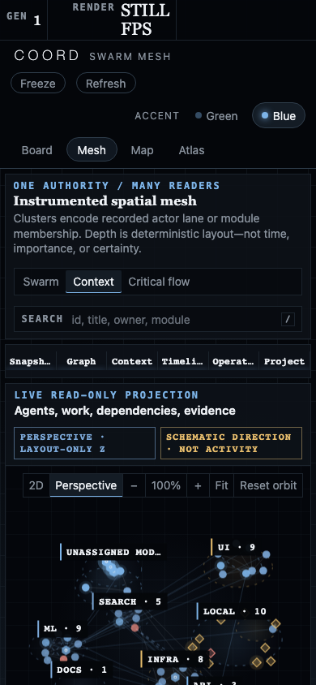

# Swarm Mesh

Swarm Mesh is the graph-first, read-only spatial view of a COORD fleet. It
places recorded owners, work, prerequisites, and execution evidence in one
deterministic scene, then keeps the receipts needed to judge what that scene
does and does not contain beside it.

  

This is the same canonical synthetic Perspective capture used on the landing page, repeated here as the reference frame for the contract below. The Context layout groups by recorded module; Perspective adds deterministic, layout-only depth; particles explain admitted typed-edge direction and never claim agent activity.

It is an instrument, not an animation of agents thinking. The surface answers:

- Which owners, work rows, and evidence objects are present in this coherent
  read?
- How does the same source graph look when grouped by actor lane, module,
  or measured prerequisite depth?
- Which event occurrences are newly observed, which are historical, and which
  lines merely explain a stored direction?
- Was anything omitted by the graph envelope or hidden by the current local
  filter?

Swarm Mesh cannot claim, assign, approve, complete, or dispatch work. It reads
the same bounded public documents as Operations Atlas, and `coord.db` remains
lifecycle authority.

## One source bundle, one graph scene

The browser fetches one `OpsAtlasBundleV1` document from
`/api/v1/operations-bundle`. The bundle contract requires:

- `snapshot` — published rows, tracked-job projections, and session flags;
- `graph` — the source-bound relationship document;
- `context` — structural row context such as prerequisites and claim custody;
- `timeline` — occurrence-only event tuples;
- `operations` — bounded analytics and `GraphEnvelopeV1`;
- `read_status` — cache generation and last-good refresh health.

The server builds those source documents from one byte-stable database copy,
derives operations from those documents, and swaps the full cache generation
under one lock. The mesh does not assemble a scene by independently fetching
documents that could straddle a refresh. See
[`server.py`](../src/coordharness/board/server.py),
[`ops_atlas_bundle_v1.schema.json`](../src/coordharness/board/ops_atlas_bundle_v1.schema.json),
and [`read_status_v1.schema.json`](../src/coordharness/board/read_status_v1.schema.json).

If a refresh fails, the last coherent generation remains on screen and the rail
changes to `DEGRADED READ`. A successful read reports `cache_generation`, the
bundle time, emitted node and edge counts, recorded-event count, live/recorded
session count, and whether the graph envelope is complete or qualified.

Freeze is a viewer operation. It holds the displayed generation and stops the
five-second automatic poll. A coherent response received while frozen can be
staged and applied on resume. Freeze does not pause sessions, claims, jobs, the
server cache, or `coord.db`.

## Graph-first composition

Two pure browser models build the scene:

1. [`ops-atlas-model.js`](../src/coordharness/board/static/ops-atlas-model.js)
   normalizes the bundle into typed nodes, edges, activity, and graph receipts.
2. [`swarm-mesh-model.js`](../src/coordharness/board/static/swarm-mesh-model.js)
   assigns deterministic clusters and three-dimensional coordinates without
   changing the source documents.

`operations.graph_envelope` is the rendered graph authority whenever it is
present, including when it truthfully emits zero nodes. The client does not
fall back to the uncapped raw graph, because doing so would silently undo
quarantine, caps, and omission accounting.

The normalized graph contains:

| Element | Source | Rendered meaning |
|---|---|---|
| Work, job, and artifact nodes | `GraphEnvelopeV1.nodes`, enriched only with matching public snapshot fields | Recorded work or evidence identity |
| Agent nodes | Published sessions plus published owner identities | Recorded session/owner identity; not a capability or process claim |
| `depends_on` | `GraphEnvelopeV1.edges` | Stored as consumer to prerequisite, rendered as prerequisite to consumer |
| `parent` | `GraphEnvelopeV1.edges` | Structural containment, not a prerequisite |
| `evidence` | `GraphEnvelopeV1.edges` | Work to declared artifact evidence |
| `runtime_evidence` | `GraphEnvelopeV1.edges` | Work to tracked-job evidence |
| `owns` | Deterministic browser join from `snapshot.rows.owner` | Current published owner to held work; a display edge, not a new database row |

Every supplied edge retains its `source_field`, `relationship_state`, stored
endpoints, and missing-state receipt. Missing endpoints remain explicit nodes.
The inspector reports the source fields behind the selected node's direct
relationships.

The scene identifies its placement algorithm as
`coord-spatial-deterministic-v1`. Cluster keys and member identities are sorted;
stable string hashes, a fixed golden angle, and fixed camera defaults determine
coordinates. The same normalized documents, layout name, and viewport produce
the same world placement. There is no force simulation, random seed, or
time-dependent drift.

### Two camera modes, one admitted topology

**2D** and **Perspective** render the same admitted nodes, edges, filters, and
selection. Perspective applies a deterministic yaw, pitch, zoom, depth scale,
fog curve, and painter order to the browser model's coordinates. Its `z` value
is a layout aid: it is not time, confidence, priority, progress, cost, or a
measured third dimension. The renderer is a deterministic Canvas 2D projection,
not a WebGL physics simulation or a digital twin.

Drag or use <kbd>Shift</kbd> + arrow keys to orbit; zoom, fit, and reset change
only the camera. Switching back to 2D preserves the selected layout and graph
membership. A sparse or zero-edge envelope does not invent depth or motion:
Perspective and Critical Flow remain unavailable, the canvas stays static, and
the admission receipt explains why.

## Three deterministic layouts

The layouts are three groupings of the same graph. Switching layouts changes
coordinates, never source state or edge membership.

### Swarm — recorded actor lane

Swarm derives a normalized actor lane such as `claude`, `codex`, `local`, or
`service` from each published owner identity, then groups nodes by that lane.
Unowned work receives its own group. Evidence inherits the display actor lane of
the work connected to it by a recorded evidence edge. That inheritance is a
browser grouping aid and is never written back.

An actor-lane cluster is not one owner identity and does not mean any owner in
that lane is live, busy, capable, or productive. Session liveness remains the
separate `snapshot.sessions[].live` flag.

  

Swarm changes grouping, not source membership. Actor-lane proximity is layout; liveness remains a separately published session flag.

### Context — recorded module

Context groups nodes by published module. Evidence inherits the module of its
recorded source work. Where a node carries several inherited modules, the scene
uses one deterministic display facet for placement; search still considers the
full published module list. Cluster proximity does not assert semantic
similarity.

This is structural context only. It is not the fact ledger, full-text index,
memory-proposal queue, or accepted-memory store.

### Critical flow — measured prerequisite layer

Critical flow reads `operations.execution.layers` and places work by measured
dependency depth. Owners and evidence occupy separate groups. Rows named by
cycle, analysis-boundary, missing-dependency, or unresolved taint receipts go
to `Depth withheld / unresolved`; rows outside the measured population go to
`Outside measured population`.

The topology panel prints `topology_metrics_status`, critical-path step count,
measured layer count, dependency-clear planned count, and maximum parallel
width. These are unit-weighted graph counts. They are not elapsed time,
remaining effort, a delivery prediction, or a duration-aware schedule. The
server-side derivation and its fail-closed population receipts are defined by
[`operations.py`](../src/coordharness/board/operations.py) and
[`ops_atlas_v1.schema.json`](../src/coordharness/board/ops_atlas_v1.schema.json).

  

Critical Flow uses measured unit-weighted prerequisite depth. Horizontal placement is a layer, not a duration or delivery forecast.

In every layout, cluster radius is display geometry derived from member count,
and depth is perspective. Neither encodes importance, certainty, priority,
duration, cost, or quality. Printed counts and receipts are the quantitative
claims.

## The motion truth contract

The motion selector always names one of three mutually exclusive meanings.
Motion never means generic activity or progress.

### Live arrivals

The first coherent read is silent. On later coherent reads, the client compares
the bounded occurrence window with the previous one. Because `TimelineV1` does
not publish an event id, the stable display key consists of event time, work id,
kind, actor, and a duplicate ordinal counted only among occurrences with that
exact four-field tuple. Reordering the bounded list, or rolling one old entry out
while retaining the others, does not change retained keys. A live arrival
therefore means **an occurrence identity absent from the prior displayed
window**, not a pushed event and not proof that work advanced. If one
indistinguishable duplicate leaves the window while another identical duplicate
arrives and the tuple count does not change, the projection fails closed and
does not animate it. A backfilled occurrence can still be newly observed even
when its event time is older.

A newly observed occurrence travels along an `owns` edge only when:

- the occurrence resolves to a visible work node;
- that work has a current published owner-hold edge; and
- the occurrence actor matches the owner node's published actor or the
  normalized lane of its published owner identity.

At most 12 matching arrivals receive a finite 1.35-second track. Actor
mismatches and unresolved placements remain stationary in the occurrence
ledger; the client does not reassign them to a plausible owner for visual
convenience. This matching rule is implemented in
[`swarm-mesh-model.js`](../src/coordharness/board/static/swarm-mesh-model.js).

### Recorded replay

Replay walks the bounded historical occurrence list in deterministic order,
one occurrence at a time. It draws a finite stationary pulse at the work node;
it never travels along an owner or dependency edge.

That distinction is necessary because the bundle publishes current topology,
not topology as it existed at each event time. A historical event can be
addressed to its current row, but the surface cannot reconstruct who held that
row, which module contained it, or which dependencies existed when the event
was recorded. Position in the traversal grid is order, not duration.

### Schematic direction

Direction mode sends repeating particles along up to 42 currently visible
typed edges. The particle follows rendered edge direction: prerequisites toward
consumers, owners toward held work, and work toward evidence. Phase and speed
are deterministic display values and carry no rate, recency, throughput,
progress, or activity claim.

`prefers-reduced-motion: reduce` suppresses live tracks, replay pulses, and
direction particles. The same nodes, edges, counts, occurrence ledger,
inspector, and integrity receipts remain available, and the renderer metric
reads `STILL`.

## Coherence, completeness, and visibility receipts

Three different kinds of absence are never collapsed:

1. **Envelope omissions** are server-accounted source elements not emitted due
   to invalid or duplicate identity, absent endpoint, node/edge/byte cap, or
   related fallout.
2. **Locally hidden nodes** are emitted nodes excluded by the selected cluster
   filter. The `HIDDEN` badge and visible-scope ledger count them.
3. **Suppressed labels** are visible nodes whose text label is withheld by the
   renderer's level-of-detail and collision rules. The node remains drawn,
   searchable, focusable, and inspectable.

`GraphEnvelopeV1` publishes raw population, eligible population, emitted nodes,
emitted edges and bytes, omissions with reason counts, identity collisions,
unknown node/edge/relationship terms, caps, source fingerprint, freshness, and
the `complete` flag. Duplicate identities are quarantined, unknown terms remain
visible, and a qualified envelope never renders as a clean zero. See
[`graph_envelope_v1.schema.json`](../src/coordharness/board/graph_envelope_v1.schema.json)
and [`graph_envelope.py`](../src/coordharness/board/graph_envelope.py).

The scope ledger prints emitted and visible nodes, emitted edges, omitted nodes
and edges, and unknown terms. The intervention ledger separately reports
missing targets, dependency cycles, expired or near-expiry claims, done rows
without recorded proof, envelope omissions, and identity collisions.

## Telemetry definitions

Every number on the rail and dock has a bounded definition:

| Label | Definition | Does not mean |
|---|---|---|
| `GEN` | `OpsAtlasBundleV1.cache_generation` | database transaction count or release version |
| `NODES` / `EDGES` | `GraphEnvelopeV1.emitted.nodes` and `.edges` | raw population or locally visible subset |
| `EVENTS` | `operations.metrics.recorded_events`; the total valid occurrence count before the bounded activity window | work completed, messages sent, or activity rate |
| `SESSIONS` | live session flags over total published sessions | process liveness, concurrent workers, or productive agents |
| `RENDER` | browser `requestAnimationFrame` callbacks per second sampled locally over roughly one second | source freshness, server throughput, or fleet speed |
| Occurrence stream | Newest seven entries from the bounded scene occurrence window | full event history or event prose |
| Edge ledger | Five most numerous rendered edge kinds, including browser-derived owner holds | database-only edge count |
| Traversal grid | Last 100 bounded occurrences, ordered and colored by actor class | elapsed time between cells or unique color per actor after four classes |
| Occurrence-density line | 18 equal display buckets across the oldest-to-newest timestamp span, normalized to the largest bucket | continuous rate, latency, or duration |
| Critical-flow ledger | Unit-weighted dependency metrics from `OpsAtlasV1.execution` and `.metrics` | time forecast or effort estimate |
| Intervention ledger | Counts of named health and envelope conditions | severity-weighted risk score |

The rail's event total can exceed the occurrence stream because
`OpsAtlasV1.activity` is intentionally bounded. The graph-envelope edge count
can be smaller than the rendered edge ledger because owner-hold edges are
deterministically joined in the browser from public snapshot fields.

## Interaction and level of detail

Pointer controls:

- drag to orbit within fixed yaw and pitch bounds;
- Shift-drag or middle-button drag to pan;
- use the wheel or camera buttons to zoom from 55% to 250%;
- click a node to pin it; hover shows the same basic identity available in the
  inspector;
- select a cluster in the roster to isolate or restore its emitted nodes.

Keyboard controls:

- `/` focuses search; Enter selects the first deterministic match; Escape
  clears and leaves search;
- with the graph viewport focused, arrow keys move spatial focus to the nearest
  node in that screen direction;
- Enter selects the focused node; Escape clears the selection;
- `+` and `-` zoom, and `0` restores the default camera;
- Tab reaches the native controls, graph viewport, inspector controls, and a
  visually hidden button that names the currently spatially focused node.

Search is a client-side match over id, label, owner, module, current step,
status, and inherited modules. Nonmatches are dimmed rather than removed.
The canonical `#sel=<row-id>` capsule accepts a selection carried from Board,
focuses the matching admitted work node, and opens the same inspector a click
would. When the bounded envelope omitted the row, the admission receipt remains
the authority; Mesh does not create a node or turn omission into absence.
Selecting a structured question uses the same bounded Operations Atlas target,
then highlights direct graph traversal: up to four downstream hops for impact
and one hop for the other questions. If the operations document supplies no
bounded target, the inspector says so and substitutes nothing.

  

A graph answer is a highlighted bounded traversal plus a source-field receipt. The surface never substitutes a plausible target when the operations document supplies none.

All nodes remain glyphs at every zoom. Text labels are collision-checked and
capped at 20 below normal zoom, 45 around normal zoom, and 90 above 145%.
Selected, hovered, keyboard-focused, attention, missing, and search-matching
nodes receive label priority within that cap. The canvas itself is hidden from
the accessibility tree; semantic controls, the focused-node navigator,
inspector, ledgers, legends, and text receipts carry its meaning.

Responsive behavior is additive rather than a different data contract. Below
1240 CSS pixels the motion switch and one telemetry panel leave the primary
layout; below 900 pixels the fleet roster moves out of view and the canvas,
inspector, and telemetry stack vertically; below 520 pixels the telemetry is a
single column and the compact legend shows node classes. The same bundle,
selection model, inspector, and receipts remain in use.

  

The phone layout is a responsive stack over the same coherent bundle, not a reduced or separately inferred graph.

## Performance ceiling

The renderer is bounded, not benchmarked.

- Operations Atlas asks the graph envelope for at most 400 nodes, at most four
  times as many edges, and at most 1,000,000 serialized node/edge bytes.
- The activity window is at most 120 occurrences.
- Canvas backing resolution is capped at device-pixel ratio 2.
- Direction particles cover at most 42 visible edges; live arrival tracks cover
  at most 12 receipts; the traversal grid covers at most 100 occurrences.
- Labels use the zoom-dependent caps above rather than attempting to print
  every identity on every frame.

The FPS rail is useful for diagnosing the current browser and viewport only.
It is not a published performance guarantee, and the source caps do not prove
that every allowed graph will meet a particular frame rate on every device.

## Privacy and read-only boundary

Swarm Mesh inherits the loopback board boundary:

- it fetches only the read-only operations bundle;
- `TimelineV1` contains occurrence time, kind, actor, and row identity, never
  event title, body, refs, payload, decision text, trust, or verdict;
- `ContextV1` contains structural context, not note or decision prose;
- every Mesh, lifecycle, graph, query, and projection route accepts only `GET`,
  `HEAD`, and `OPTIONS`; the board's separate optional usage-integration route
  may accept one tightly allowlisted local sign-in `POST` and cannot mutate
  `coord.db`;
- the board has no authentication, authorization, tenant isolation, TLS, or
  safe public-host mode.

Read-only does not mean internet-safe. Keep the board on a trusted local
machine. Full details are in
[`security-and-privacy.md`](security-and-privacy.md).

## Explicit limitations

Swarm Mesh deliberately does not provide:

- **a knowledge plane** — no facts, full-text index, memory proposals, accepted
  memory, or retrieval trace enters the mesh;
- **historical topology** — replay addresses occurrence history to current row
  nodes but cannot reconstruct owner, module, claim, dependency, or evidence
  state at the event time;
- **capability inference** — actor, owner, module, node kind, session flag, and
  event count do not establish tool access, permission, skill, role, or
  availability;
- **cost inference** — there is no token, currency, energy, labor, or resource
  spend model;
- **productivity inference** — event volume, graph centrality, session liveness,
  progress, rendered motion, and FPS are not output quality, effort, velocity,
  utilization, or individual performance;
- **duration-aware scheduling** — dependency layer and critical path count rows
  of unknown size;
- **complete unbounded history** — graph and activity documents have published
  caps and omission receipts;
- **a control plane** — graph questions, search, filters, camera controls,
  refresh, and freeze change only the browser view.

For the shared graph semantics, dependency safeguards, and source-bound
capability boundary, see [`operations-atlas.md`](operations-atlas.md).

## Source index

- Page structure and visible contract:
  [`swarm-mesh.html`](../src/coordharness/board/static/swarm-mesh.html)
- Renderer, interactions, motion, receipts, and telemetry:
  [`swarm-mesh.js`](../src/coordharness/board/static/swarm-mesh.js)
- Deterministic layout and occurrence placement:
  [`swarm-mesh-model.js`](../src/coordharness/board/static/swarm-mesh-model.js)
- Shared typed graph normalization:
  [`ops-atlas-model.js`](../src/coordharness/board/static/ops-atlas-model.js)
- Source bundle and cache coherence:
  [`server.py`](../src/coordharness/board/server.py)
- Machine-readable contracts:
  [`ops_atlas_bundle_v1.schema.json`](../src/coordharness/board/ops_atlas_bundle_v1.schema.json),
  [`ops_atlas_v1.schema.json`](../src/coordharness/board/ops_atlas_v1.schema.json),
  [`graph_envelope_v1.schema.json`](../src/coordharness/board/graph_envelope_v1.schema.json),
  [`native_snapshot_v1.schema.json`](../src/coordharness/board/native_snapshot_v1.schema.json),
  and [`read_status_v1.schema.json`](../src/coordharness/board/read_status_v1.schema.json)
