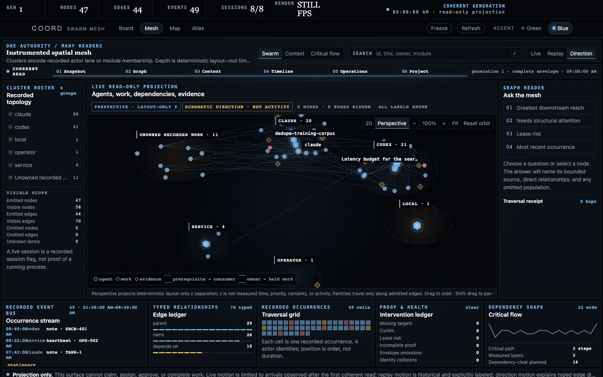
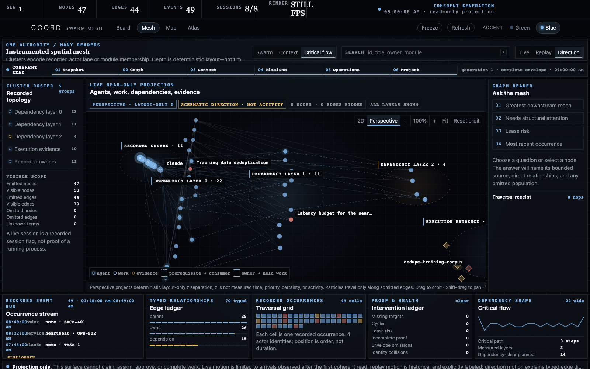
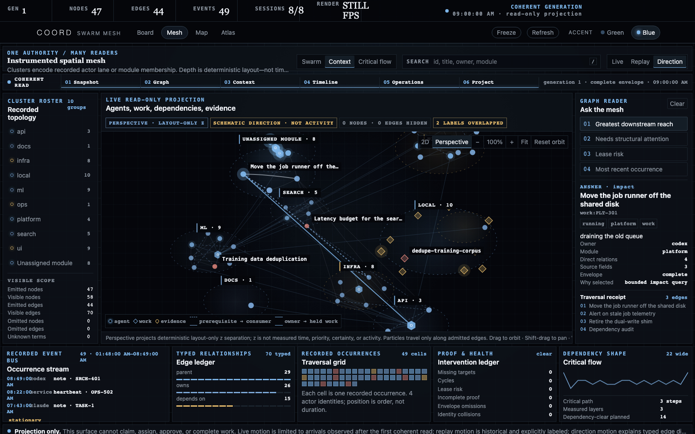

# Visual atlas

These diagrams explain relationships that are easier to misread in prose: who may write, what makes state live, how child work rolls up, where context becomes derived, and why a projection is not another authority.

Every SVG is original vector markup under [`assets/`](assets/), includes an embedded `<title>` and `<desc>`, adapts to GitHub light/dark themes, and uses text labels in addition to color. Provenance is machine-readable in [`assets/provenance.json`](assets/provenance.json).

## 1. The one-picture overview

**Question answered:** What is the whole system in one frame? **Source truth:** the lifecycle functions in `coord/coord_db.py` and the read-only projections under `board/` and `apps/`. **Boundary:** the left-to-right lifecycle order is meaningful; distance between marks, and the order the agent marks appear in, are not. The three marks stand for the kinds of caller the harness expects, not for any endorsement by their owners.

## 2. Product system architecture

**Question answered:** How do all product surfaces fit together? **Source truth:** `src/coordharness/coord/`, `src/coordharness/board/`, and the native snapshot consumers under `apps/`. **Boundary:** only typed core operations write; dashed projection paths are read-only.

## 3. Detailed internal architecture

**Question answered:** Where do policy blocks, derived SQL views, and snapshot clients split? **Source truth:** `coord/policy/pipeline.py`, `coord/coord_db.py`, and `board/`. **Difference from diagram 1:** this is an implementation-level zoom, not another product overview.

## 4. CLI, MCP, and Python single-authority flow

**Question answered:** Are the CLI, MCP server, and Python API separate coordination systems? **Source truth:** `entry.py`, `coord/cli.py`, `coord/mcp_coord_server.py`, and `coord/coord_db.py`. They normalize different request shapes into one lifecycle history; there is no client-to-client synchronization step.

## 5. Source-generated claim lifecycle

**Question answered:** Which claim statuses and guarded lifecycle verbs does the current code implement? **Source truth:** `RELEASABLE_CLAIM_STATUSES`, `_HELD_CLAIM_STATUSES`, and the lifecycle functions in `coord/coord_db.py`. `tools/generate_lifecycle_diagram.py --check` makes source drift fail CI.

## 6. Lease and proof path

**Question answered:** What exactly keeps work “running,” and what allows it to become “done”? **Source truth:** claim start/heartbeat/completion in `coord/coord_db.py` and proof validation in `jobs/status.py`. **Difference from diagram 4:** this zooms in on the two honesty guards instead of every state.

## 7. Multi-agent and local-job orchestration

**Question answered:** Which work deserves a durable claim, a child summary, or a tracked process? **Source truth:** `agent_sessions`, `claims`, and `runs` in the schema plus `src/coordharness/jobs/`. Subagents roll up; long processes publish bounded telemetry; outputs stay outside the database.

## 8. Typed cross-agent handoff

**Question answered:** Why can’t another agent simply claim an owned row? **Source truth:** the guarded `handoff_existing` implementation in `coord/mcp_coord_server.py` and transaction helpers in `coord/coord_db.py`. Expected version, assignee, and event heads prevent silent overwrite.

**Question answered:** What happens in what order? The panel order is the transaction sequence; distance and panel size carry no timing or importance claim.

## 9. Bounded context, before and after

**Question answered:** Why does a bounded capsule exist at all? **Source truth:** the preflight and capsule builders behind `coord/board_context.py`, and the ordered policy checks in `coord/policy/pipeline.py`. **Boundary:** the left panel is the failure mode this design refuses, not a description of any component in this repository; the byte ceiling shown is the configured budget, not a measurement of a particular session.

## 10. Context, evidence, and memory planes

**Question answered:** Which context is authoritative and which is a retrieval aid? **Source truth:** `coord/board_context.py`, `coord/exact_query_core.py`, `knowledge/`, and exact board records. The dependency/evidence graph is source-bound and **Preview**; fresh generic capsules/lenses are accepted, strict reads retain exact-authority gates, and neither is a freeform whiteboard.

## 11. Bounded context tiers

**Question answered:** How does a session expand context without loading everything? **Source truth:** boot capsule, board lens, and context federation code. **Difference from diagram 8:** this shows retrieval depth and budgeting; the generic board-backed path is accepted while graph interpretation and strict deployment authority remain separate boundaries.

## 12. Web and native projection topology

**Question answered:** Can a viewer mutate coordination state? **Source truth:** `src/coordharness/board/` and native `URLSession` clients. The server uses a read-only SQLite connection, accepts `GET`/`HEAD`, and refuses mutation methods. Native clients may cache the last good snapshot without making that cache authoritative.

## 13. Extraction and publication safety

**Question answered:** How does code leave a private source without treating redaction as proof? **Source truth:** `tools/extract/port.py`, manifests, `tools/extract/gate.py`, and [releasing](releasing.md). A clean gate creates a release candidate; it does not change repository visibility or authorize publication.

## 14. Live graph-first control room

The Swarm Mesh captures are generated from the deterministic fictional board and
document an interactive product surface rather than a hand-authored diagram.

<table>
<tr>
<td width="50%"> <b>Context</b> — recorded module grouping.</td>
<td width="50%"> <b>Swarm</b> — actor lanes derived from published owner identities.</td>
</tr>
<tr>
<td width="50%"> <b>Critical Flow</b> — measured prerequisite depth.</td>
<td width="50%"> <b>Traversal</b> — one bounded path and its source fields.</td>
</tr>
</table>

**Question answered:** How is the published fleet connected in one coherent read,
and what receipts qualify the picture? **Source truth:** the atomic operations
bundle, graph envelope, `swarm-mesh-model.js`, and `swarm-mesh.js`. **Boundary:**
cluster placement and perspective are deterministic layout; Critical Flow depth is
measured from recorded prerequisites; bright direction particles are schematic;
historical replay is stationary; only a newly observed actor-matched occurrence may
traverse a current hold. See [Swarm Mesh](swarm-mesh.md) for the complete contract.

## Maintenance contract

When implementation changes one of these relationships:

1. update the SVG and its embedded description together;
2. update the matching atlas source-truth note;
3. keep [`feature-status.json`](feature-status.json) consistent with maturity labels;
4. validate every SVG as XML and confirm every asset still has a title and description;
5. update [`assets/provenance.json`](assets/provenance.json) if a file is added, renamed, or removed.
