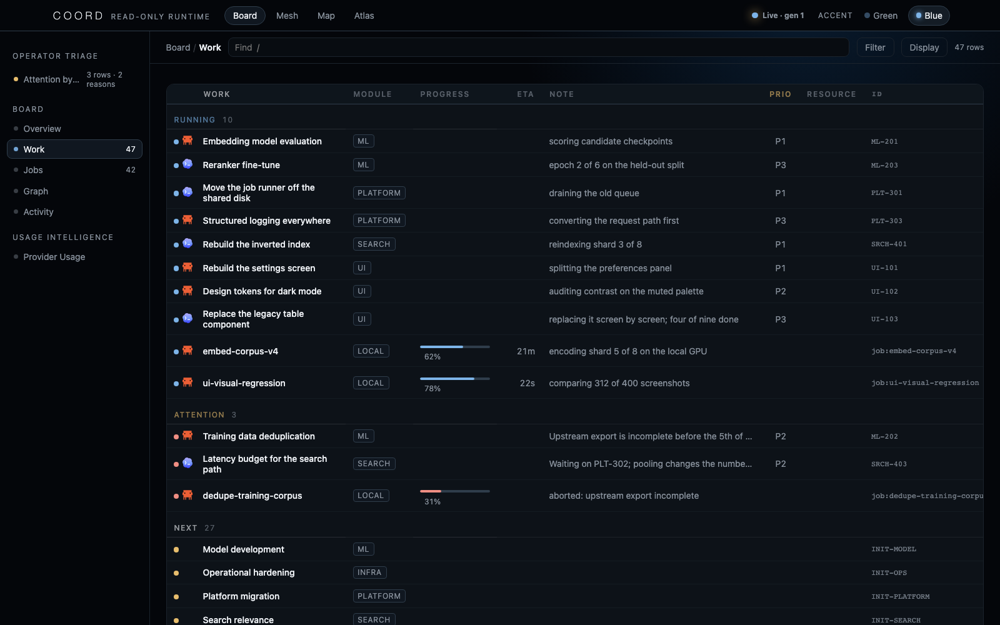
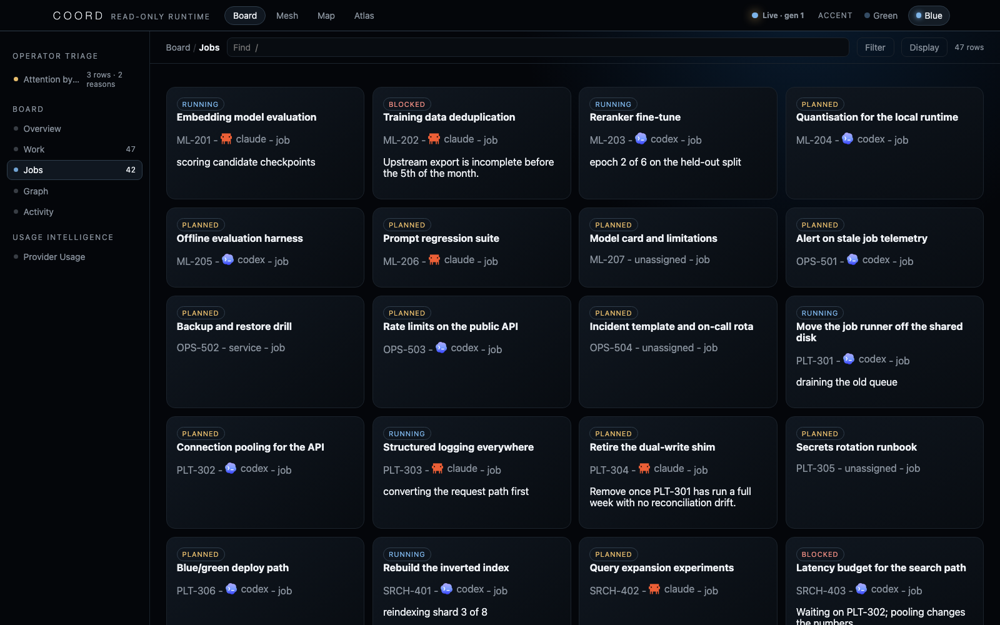
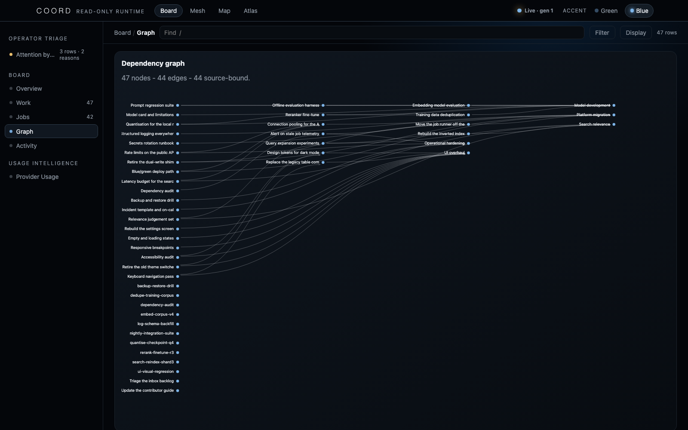

# Web board

Status: **Preview** in [`feature-status.json`](feature-status.json).

The web board is a dependency-free, read-only projection for one local `coord.db`. It is a viewer, not a coordination service.

## Run

```bash
coord-board --db .coordharness/coord.db
```

Default base URL: `http://127.0.0.1:7870`.

| Route | Contract |
|---|---|
| `/` | Packaged browser dashboard |
| `/api/v1/snapshot` | Versioned JSON snapshot for web/native clients |
| `/api/v1/schema` | Snapshot JSON schema |
| `/healthz` | Lightweight health response |

The exact command flags are defined by `coord-board --help`. The documented default and routes should be reverified whenever `src/coordharness/board/` changes.

## Shipped views

The packaged tabs below are captured from the deterministic fictional board produced by `python -m coordharness.demo`.

For a documentation refresh, start the loopback board against that seeded database and run
`python tools/capture_board_screens.py`. The helper fixes the viewport, color scheme, locale, and
timezone; it refuses a graph capture unless the page rendered at least one real relationship edge.
Exact checked-in hashes remain declared in [`assets/provenance.json`](assets/provenance.json).

<p align="center">
  
</p>

<p align="center">
  
</p>

<p align="center">
  
</p>

<p align="center">
  
</p>

These PNGs are release evidence only because they are synthetic, fixed-clock, hash-pinned, metadata-checked, and linked to source truth in [`assets/provenance.json`](assets/provenance.json).

## Read-only boundary

- Server binding is loopback by default. Non-loopback requires both the
  `--allow-remote` flag and an explicit `--allowed-host`; this escape hatch
  adds no authentication and is not a safe-publication mode.
- SQLite opens in read-only/query-only mode.
- Only `GET` and `HEAD` are handled as reads.
- `OPTIONS` returns method metadata without reading or mutating board state.
- `POST`, `PUT`, `PATCH`, and `DELETE` return `405`.
- Host-header checks reduce DNS-rebinding exposure.
- Responses use no-store and content-type hardening headers.

These controls prevent the viewer from accidentally becoming another writer. They do not provide authentication, authorization, tenant isolation, TLS termination, or safe internet exposure.

## Snapshot compatibility

The API is namespaced under `/api/v1/`. Consumers must ignore unknown fields and tolerate stale or unavailable snapshots. Lifecycle truth remains in `coord.db` even if the board is stopped or a client displays its last-good cache.

<p align="center">
  
</p>

See [compatibility](compatibility.md) and [security and privacy](security-and-privacy.md).
